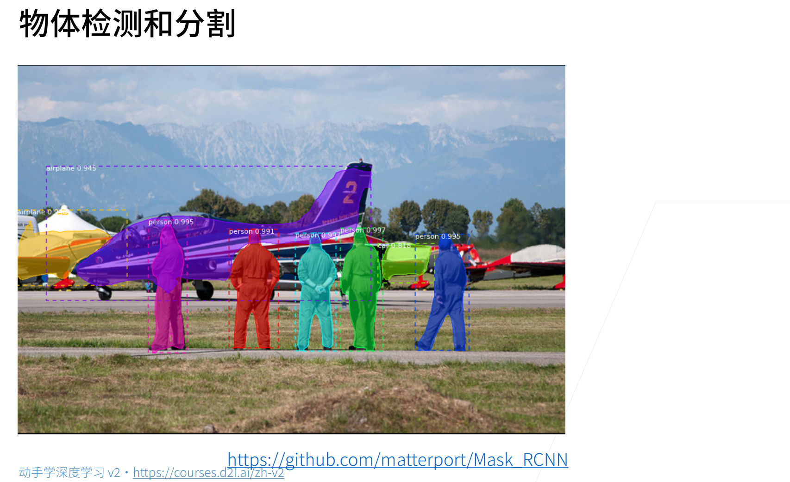
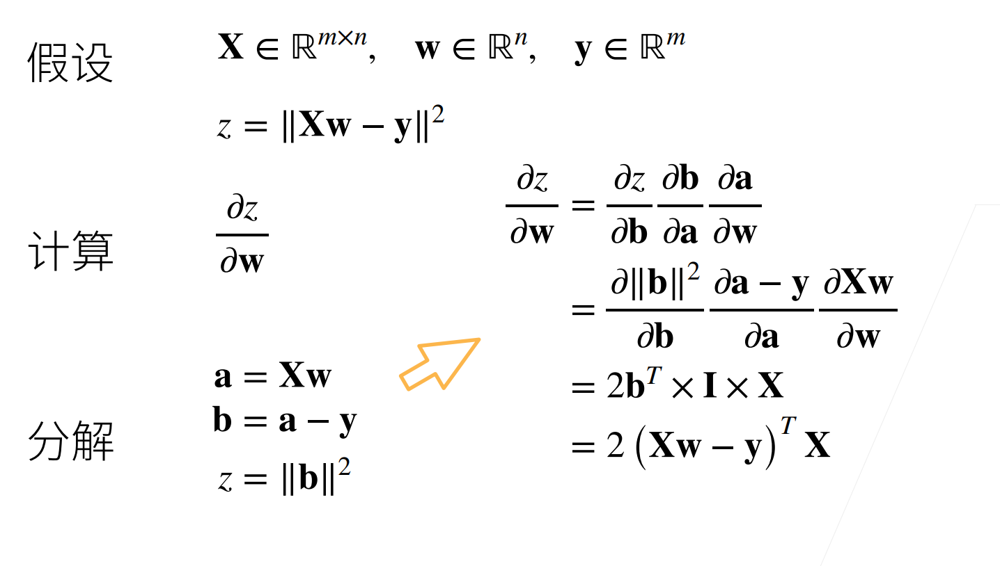
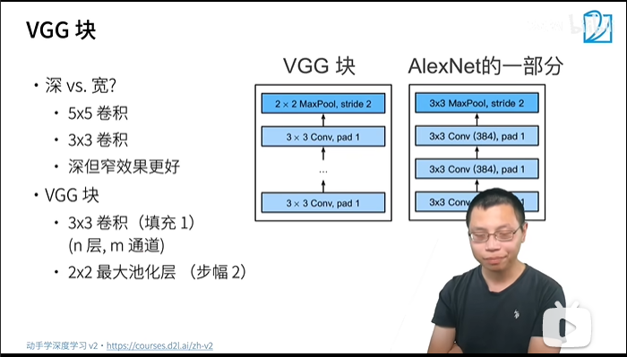
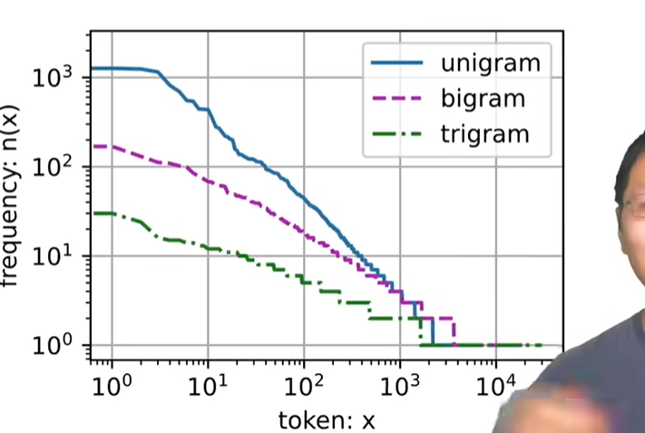
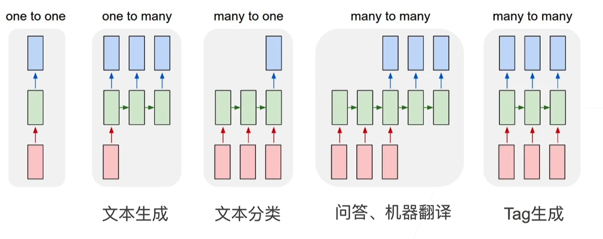

[TOC]

## Part 0: DL Basis

### 1. Introduction

**An AI map:**


**Some fields of DL**

1. image classification:

[ImageNet](http://www.image-net.org):


2. object detection and segmentation

[RCNN](https://github.com/matterport/Mask_RCNN)



3. [style transfer](https://github.com/zhanghang1989/MXNet-Gluon-Style-Transfer/)(样式迁移)
   
   

4. face composition


5. [image generation by description](https://openai.com/blog/dall-e/)


6. text generation


7. self-driving


### 2. Data processing using Pytorch

#### a. data operation

1. high-dimension array sample:


2. visit elements:


3. implementation of data operation:

```python
import torch  # not 'pytorch'

# SAMPLES
x = torch.arange(12) # generate an array [0,1,2,...,11]
x.shape # return the shape of x
x.numel() # return the element number of x
x.reshape(3,4) # reshape x to a 3*4 matrix
torch.tensor() # just like np.array()

# alike that in MATLAB
torch.zeros()
torch.ones()
torch.eye()

# fundamental operators see trick 2

torch.cat(arrays:tuple,dim:int) # concatenate tensors in a certain dimension
x.sum(dim:int) # get the sum of all elements of x or in a certain dim

A = x.numpy() # convert from tensor to numpy ndarray
B = torch.tensor(A) # convert from numpy ndarray to tensor

a = torch.tensor([3.5])
a.item() # convert 1*1 tensor to python scalar
```

**tricks**

1. No need to manually compute all the dimensions when using `reshape` we can use -1 to leave the calculation for the computer.


2. fundamental operators:


3. broadcasting (prone to misuse)

 

4. saving memory


do the operation **in place!**

#### b. data pre-processing

**an example on a super simple dataset**

1. handling unknown data

2 approaches: interpolation and delete, we consider interpolation here.

fill the N/A with the average of known data


for the discrete value, we consider NaN as a class:


2. convert to tensor


### 3. Linear Algebra

#### a. theories

1. matrix multiplication is twisting the space:


2. norms of matrix


3. symmetric & anti-symmetric


4. positive-definite:


5. orthogonal matrix & permutation matrix:


example of permutation matrix:


6. eigenvalue & eigen-vector


#### b. Pytorch implementation

```python
import torch
# x is a vector
len(x) # python int
x.size() # torch.Size equivalent to x.shape
x.T # transpose of x
y = x.clone() # clone x to y with allocating new memory

# A B are matrices
A*B # Hadamard product

torch.dot() # vectors dot
torch.mv() # matrix-vector multiplication
torch.mm() # matrix-matrix mul

# There is a operator @ in Python 3 which is capable to handle all the situations above

torch.norm() # default compute L2-norm of a vector or the F-norm of a matrix
```

**tricks**

1. sum with dimension kept(set `keepdims=True`) then we can use broadcasting:


2. cumulative sum: keep dimension, computes the cumulative sum of a tensor

### 4. Calculus

#### a. theories

1. scalar derivative


2. gradient

numerator layout & denominator layout:

numerator layout is used below


3. overview


4. scalar/**vector**


examples


5. **vector**/scalar


6. **vector**/**vector**


examples:


expand to matrix input:


#### b. auto gradient

1. chain law of derivative


example:

1.


2.



2. auto gradient

the principle: computation graph(计算图)


explicitly constructed in TF/MXNet


implicitly constructed in torch/MXNet


modes of autograd:

FP(Forward Propagation) & **BP(Backward Propagation)**


**BP actually prune the unnecessary branches!**


complexity comparison:


#### c. Pytorch implementation

```python
import torch
# to compute the gradient, we shall do this to store it:
x = torch.arange(4.)
x.requires_grad_(True)
# OR
x = torch.arange(4.0,requires_grad=True)
# then calculate the gradient
y = 2*torch.dot(x,x) # the function to compute the gradient
y,backward() # BP, the result will be stored in x.grad

# if you want to compute another function, you shall do this first or the gradient will cumulate(add)
x.grad.zero_()

# for non-scalar variants you shall convert it to a scalar using .sum() function(?)
y = x*x
y.sum().backward()

# you can move some results out of the computation graph (make the result not a function of x)
u = y,detach()

# you can compute the gradient even for a Python function
```

### 5. Probability

#### a. theories

1. joint probability


2. conditional probability


3. Bayes'  Theorem


4. marginalization


5. independence


6. [Here](https://zh-v2.d2l.ai/chapter_preliminaries/probability.html#conditional-prob-d2) is an example to apply all the things above and show the probability is contrast to the gut feeling
7. expectation & square deviation


8. **likelihood & MLE**

a. likelihood

likelihood is equal to probability numerically, but the difference is:


Likelihood is **estimating the parameters** according to the observation of variables. it itself is **still a kind of probability**

Why likelihood is equal to probability numerically?


So we can also consider likelihood above as a function and draw the graph below:


b. MLE(Maximum Likelihood Estimation)


Actually as far as I know, linear regression and logistic regression are essentially MLE problems

### 6. Linear Regression

#### a. theories

1. linear model:


it can be considered as a 1-layer NN:


2. normal distribution and MSE

**Why MSE can be the loss function for linear regression**

As linear regression is an MLE problem, we assume there are noises among observation:

$$
y = \mathbf{w}^\top \mathbf{x} + b + \epsilon
$$

where $\epsilon \sim \mathcal{N}(0, \sigma^2)$

We can write the likelihood of $y$ given an $\mathbf x$

$$
P(y \mid \mathbf{x}) = \frac{1}{\sqrt{2 \pi \sigma^2}} \exp\left(-\frac{1}{2 \sigma^2} (y - \mathbf{w}^\top \mathbf{x} - b)^2\right)
$$

as $\epsilon=y-\mathbf w^\top \mathbf x-b$

the optimistic values of $\mathbf w$ and $b$ are:

$$
\operatorname*{argmax}_{\mathbf w,b}P(\mathbf y \mid \mathbf X) = \prod_{i=1}^{n} p(y^{(i)}|\mathbf{x}^{(i)})
$$

where $\mathbf x^{(i)}$ and $y^{(i)}$ represents an example in the dataset.

convert it to minimized logarithm likelihood:

$$
\operatorname*{argmin}_{\mathbf w,b}-\log P(\mathbf y \mid \mathbf X) = \sum_{i=1}^n \frac{1}{2} \log(2 \pi \sigma^2) + \frac{1}{2 \sigma^2} \left(y^{(i)} - \mathbf{w}^\top \mathbf{x}^{(i)} - b\right)^2
$$

as the first item and $\dfrac{1}{2\sigma^2}$ is independent with $\mathbf w$ and $b$, the objective above is equivalent to MSE in linear regression

*This is also the reason why logistic regression uses cross entropy as the loss.*

3. basic optimization algorithms

a. gradient descent

basic steps:


mini-batch GD(default optimization algorithm in GD)


#### b. Pytorch implementation from scratch

from scratch:

1. dataset generate & read
2. model definition
3. loss definition
4. initialize parameters

all implemented by yourself

```python
import torch
torch.normal(mean, std, size:tuple) # return a normal distribution
with torch.no_grad() # disable gradient computation, saving memory (make sure you will not invoke backward())
```

#### c. Pytorch concise implementation

all those above not implemented but using torch APIs

```python
from torch import nn
from torch.utils import data

def load_array(data_arrays, batch_size, is_train=True):  #@save
    """构造一个PyTorch数据迭代器"""
    dataset = data.TensorDataset(*data_arrays)
    return data.DataLoader(dataset, batch_size, shuffle=is_train)

net = nn.Sequential(nn.Linear(2, 1)) # linear network Sequential is a list of NN layers

net[0].weight.data.normal_(0, 0.01) # initialize the weight by normal distribution
net[0].bias.data.fill_(0) # initialize bias

loss = nn.MSELoss() # loss
trainer = torch.optim.SGD(net.parameters(), lr=0.03) # optimizer

# training
num_epochs = 3
for epoch in range(num_epochs):
    for X, y in data_iter:
        l = loss(net(X) ,y)
        trainer.zero_grad()
        l.backward()
        trainer.step() # update parameters
    l = loss(net(features), labels)
    print(f'epoch {epoch + 1}, loss {l:f}')
```

### 7. Softmax Regression

#### a. theories

1. from regression to classification


2. encoding

a. for gt:


b. for prediction:


3. cross entropy


**MLE deduction**

1. Still, from the original form of MLE,  we can write the likelihood as:

$$
P(\mathbf{Y} \mid \mathbf{X}) = \prod_{i=1}^n P(\mathbf{y}^{(i)} \mid \mathbf{x}^{(i)})
$$

2. To maximize the likelihood, we can minimize the negative logarithm likelihood:

$$
-\log P(\mathbf{Y} \mid \mathbf{X}) = \sum_{i=1}^n -\log P(\mathbf{y}^{(i)} \mid \mathbf{x}^{(i)})
= \sum_{i=1}^n l(\mathbf{y}^{(i)}, \hat{\mathbf{y}}^{(i)})
$$

where:

$$
l(\mathbf{y}, \hat{\mathbf{y}}) = - \sum_{j=1}^q y_j \log \hat{y}_j.
$$

and:

$$
\hat{\mathbf{y}} = \mathrm{softmax}(\mathbf{o})\quad \text{where}\quad \hat{y}_j = \frac{\exp(o_j)}{\sum_k \exp(o_k)}
$$

3. rewrite optimization objective:

$$
l(\mathbf{y}, \hat{\mathbf{y}}) =  - \sum_{j=1}^q y_j \log \frac{\exp(o_j)}{\sum_{k=1}^q \exp(o_k)} \\
= \sum_{j=1}^q y_j \log \sum_{k=1}^q \exp(o_k) - \sum_{j=1}^q y_j o_j\\
= \log \sum_{k=1}^q \exp(o_k) - \sum_{j=1}^q y_j o_j.

$$

4. gradient of optimization objective

$$
\partial_{o_j} l(\mathbf{y}, \hat{\mathbf{y}}) = \frac{\exp(o_j)}{\sum_{k=1}^q \exp(o_k)} - y_j = \mathrm{softmax}(\mathbf{o})_j - y_j
$$

#### b. fundamentals of information theory

1. entropy

quantified information of a certain distribution $P$ is:

$$
H(P) = \sum_j - P(j) \log P(j)
$$

one of the basic theorems in information theory points out that to encode a randomly sampled data from a distribution $P$ , at least $H(P)$ 'nats' = $\dfrac{1}{\ln(2)}$ bits

2. what is cross entropy actually?


#### c. commonly used loss functions

1. L2 loss


2. L1 loss


3. Huber's robust loss


#### d. Pytorch from scratch

1. dataset Fashion-MNIST


2. softmax implementation

what we actually do: **feed the softmax function with linear model**

a. read the fashion-MNIST dataset

b. flatten the image, regard each pixel as a feature (lose some spatial info, can be solved by CNN)

c. initialize the parameters

```python
import torch
num_inputs = 784 # 28*28
num_outputs = 10 # 10 classes

W = torch.normal(0, 0.01, size=(num_inputs, num_outputs), requires_grad=True)
b = torch.zeros(num_outputs, requires_grad=True)
```

d. **define model and loss:**

```python
# define the model
def softmax(X):
    X_exp = torch.exp(X)
    partition = X_exp.sum(1, keepdim=True)
    return X_exp / partition  # broadcast


def net(X):
    return softmax(torch.matmul(X.reshape((-1, W.shape[0])), W) + b)

# define loss

# select elements
y = torch.tensor([0, 2])
y_hat = torch.tensor([[0.1, 0.3, 0.6], [0.3, 0.2, 0.5]])
y_hat[[0, 1], y] # this is a new method to select elements

# the cross entropy
def cross_entropy(y_hat, y):
    return - torch.log(y_hat[range(len(y_hat)), y])
```

e. define the accuracy

```python
def accuracy(y_hat, y):  #@save
    """计算预测正确的数量"""
    if len(y_hat.shape) > 1 and y_hat.shape[1] > 1:
        y_hat = y_hat.argmax(axis=1)
    cmp = y_hat.type(y.dtype) == y
    return float(cmp.type(y.dtype).sum())
```

e(extra)

for any net we can evaluate the accuracy:

```python
def evaluate_accuracy(net, data_iter):  #@save
    """计算在指定数据集上模型的精度"""
    if isinstance(net, torch.nn.Module):
        net.eval()  # 将模型设置为评估模式
    metric = Accumulator(2)  # 正确预测数、预测总数
    with torch.no_grad():
        for X, y in data_iter:
            metric.add(accuracy(net(X), y), y.numel())
    return metric[0] / metric[1]
```

the `Accumulator` class is as below:

```python
class Accumulator:  #@save
    """在n个变量上累加"""
    def __init__(self, n):
        self.data = [0.0] * n

    def add(self, *args):
        self.data = [a + float(b) for a, b in zip(self.data, args)]

    def reset(self):
        self.data = [0.0] * len(self.data)

    def __getitem__(self, idx):
        return self.data[idx]
```

f. **train the model**

```python
def train_epoch_ch3(net, train_iter, loss, updater):  #@save  1 epoch
    """训练模型一个迭代周期（定义见第3章）"""
    # 将模型设置为训练模式
    if isinstance(net, torch.nn.Module):
        net.train()
    # 训练损失总和、训练准确度总和、样本数
    metric = Accumulator(3)
    for X, y in train_iter:
        # 计算梯度并更新参数
        y_hat = net(X)
        l = loss(y_hat, y)
        if isinstance(updater, torch.optim.Optimizer):
            # 使用PyTorch内置的优化器和损失函数
            updater.zero_grad()
            l.mean().backward()
            updater.step()
        else:
            # 使用定制的优化器和损失函数
            l.sum().backward()
            updater(X.shape[0])
        metric.add(float(l.sum()), accuracy(y_hat, y), y.numel())
    # 返回训练损失和训练精度
    return metric[0] / metric[2], metric[1] / metric[2]

# the optimizer

lr = 0.1

def updater(batch_size):
    return d2l.sgd([W, b], lr, batch_size)

def train_ch3(net, train_iter, test_iter, loss, num_epochs, updater):  #@save n epochs
    """训练模型（定义见第3章）"""
    animator = Animator(xlabel='epoch', xlim=[1, num_epochs], ylim=[0.3, 0.9],
                        legend=['train loss', 'train acc', 'test acc'])
    for epoch in range(num_epochs):
        train_metrics = train_epoch_ch3(net, train_iter, loss, updater)
        test_acc = evaluate_accuracy(net, test_iter)
        animator.add(epoch + 1, train_metrics + (test_acc,))
    train_loss, train_acc = train_metrics
    assert train_loss < 0.5, train_loss
    assert train_acc <= 1 and train_acc > 0.7, train_acc
    assert test_acc <= 1 and test_acc > 0.7, test_acc
```


g. prediction

```python
def predict_ch3(net, test_iter, n=6):  #@save
    """预测标签（定义见第3章）"""
    for X, y in test_iter:
        break
    trues = d2l.get_fashion_mnist_labels(y)
    preds = d2l.get_fashion_mnist_labels(net(X).argmax(axis=1))
    titles = [true +'\n' + pred for true, pred in zip(trues, preds)]
    d2l.show_images(
        X[0:n].reshape((n, 28, 28)), 1, n, titles=titles[0:n])
```

#### e. Pytorch concise

1. initialize the parameters

```python
# PyTorch不会隐式地调整输入的形状。因此，
# 我们在线性层前定义了展平层（flatten），来调整网络输入的形状
net = nn.Sequential(nn.Flatten(), nn.Linear(784, 10))

def init_weights(m):
    if type(m) == nn.Linear:
        nn.init.normal_(m.weight, std=0.01)

net.apply(init_weights) # run init_weights in all the layers of net
```

2. define the loss & optimizers

```python
loss = nn.CrossEntropyLoss(reduction='none')
trainer = torch.optim.SGD(net.parameters(), lr=0.1)
```

3. train the model

```python
num_epochs = 10
d2l.train_ch3(net, train_iter, test_iter, loss, num_epochs, trainer)
```


#### f. re-estimate the implementation of scratch softmax

$\hat y_j = \dfrac{\exp(o_j)}{\sum_k \exp(o_k)}$ may overflow if $o_k$ is large

A trick to solve this is substract $\max(o_k)$ from all $o_k$, this won't change the result of softmax:

$$
\begin{aligned}
\hat y_j & =  \frac{\exp(o_j - \max(o_k))\exp(\max(o_k))}{\sum_k \exp(o_k - \max(o_k))\exp(\max(o_k))} \\
& = \frac{\exp(o_j - \max(o_k))}{\sum_k \exp(o_k - \max(o_k))}
\end{aligned}

$$

but if $o_j-\max(o_k)$ is too small, it may underflow, but if we consider cross entropy together with this, the problem will be solved as $\log(\exp(\dots))$ is counteraction.

Thus:

$$
\begin{aligned}
\log{(\hat y_j)} & = \log\left( \frac{\exp(o_j - \max(o_k))}{\sum_k \exp(o_k - \max(o_k))}\right) \\
& = \log{(\exp(o_j - \max(o_k)))}-\log{\left( \sum_k \exp(o_k - \max(o_k)) \right)} \\
& = o_j - \max(o_k) -\log{\left( \sum_k \exp(o_k - \max(o_k)) \right)}
\end{aligned}
$$

### 8. MLP(Multi-Layer Perceptron)

#### a. theories

1. MLP


how to train an original perceptron


convergence theorem for MLP


a linear MLP **cannot solve XOR problems**


### b. MLP from scratch

The training method is all the same as that of softmax, the only difference is the definition of model

a. **definition of ReLU**

```python
def relu(X):
    a = torch.zeros_like(X)
    return torch.max(X, a)
```

b. **definition of model**

```py
def net(X):
    X = X.reshape((-1, num_inputs))
    H = relu(X@W1 + b1)  # 这里“@”代表矩阵乘法
    return (H@W2 + b2)
```

c.  **definition of loss**

We still use cross-entropy here

```py
loss = nn.CrossEntropyLoss(reduction='none')
```

### c. Pytorch concise

前のパートと同じ、ただモデルの定義は違います：

```python
net = nn.Sequential(nn.Flatten(),
                    nn.Linear(784, 256),
                    nn.ReLU(),
                    nn.Linear(256, 10))
```

もう1つリニア層が増えて、ReLU層も増えています。

### 9. Model Selection

The main theoretical issues can be found in notes of Shuang Liang and Andrew Ng

#### a. Underfit & Overfit

**the capacity(complexity) of the model**

the capacity of the model shall be initially large enough and then decrease this (by weight decay or dropout) to get the lowest generalization error


The circled '1' s are biases.

*VC dimension*


some results


not commonly used in deep learning, as this is not accurate and hard to compute

### 10. Regularization Skills

#### a. Weight Decay

1. hard limit


2. soft limit


3. visualization of affect of penalty to the optimization


4. update of the params


5. Pytorch implementation

(1) from scratch

Firstly, define the L2-penalty:

```python
def l2_penalty(w):
    return torch.sum(w.pow(2)) / 2 
```

Then add L2-penalty to the loss:

```python
# 增加了L2范数惩罚项
# 广播机制使l2_penalty(w)成为一个长度为batch_size的向量
l = loss(net(X), y) + lambd * l2_penalty(w)
```

where lambda is a tunable hyper-parameter

L1 performs better than L2:

L2:


L1:


(2) concise

the penalty is in the trainer:

```py
 # 偏置参数没有衰减
trainer = torch.optim.SGD([
        {"params":net[0].weight,'weight_decay': wd},
        {"params":net[0].bias}], lr=lr)
```

typically it is faster than that is implemented from scratch

#### b. Dropout

1. theories

It is essentially adding noises between layers

In standard dropout regularization, the noises is:

$$
\begin{aligned}
h' =
\begin{cases}
    0 & \text{ probability is } p \\
    \dfrac{h}{1-p} & \text{otherwise}
\end{cases}
\end{aligned}
$$

The expectance of $h^\prime$ is equal to that of $h$

Dropout is usually used at the output point of hidden layers:


The visualization


In inference, dropout outputs the same thing as the input.

**Dropout is used only in training!**

2. Pytorch implementation

(a) from scratch

Firstly, we implement a `dropout` layer:

```py
def dropout_layer(X, dropout):
    assert 0 <= dropout <= 1
    # 在本情况中，所有元素都被丢弃
    if dropout == 1:
        return torch.zeros_like(X)
    # 在本情况中，所有元素都被保留
    if dropout == 0:
        return X
    # to determine which is dropped
    mask = (torch.rand(X.shape) > dropout).float()
    return mask * X / (1.0 - dropout)
```

 Then we define a net structure trained by FashionMNIST

```py
dropout1, dropout2 = 0.2, 0.5

class Net(nn.Module):
    def __init__(self, num_inputs, num_outputs, num_hiddens1, num_hiddens2,
                 is_training = True):
        super(Net, self).__init__()
        self.num_inputs = num_inputs
        self.training = is_training
        self.lin1 = nn.Linear(num_inputs, num_hiddens1)
        self.lin2 = nn.Linear(num_hiddens1, num_hiddens2)
        self.lin3 = nn.Linear(num_hiddens2, num_outputs)
        self.relu = nn.ReLU()

    def forward(self, X):
        H1 = self.relu(self.lin1(X.reshape((-1, self.num_inputs))))
        # 只有在训练模型时才使用dropout
        if self.training == True:
            # 在第一个全连接层之后添加一个dropout层
            H1 = dropout_layer(H1, dropout1)
        H2 = self.relu(self.lin2(H1))
        if self.training == True:
            # 在第二个全连接层之后添加一个dropout层
            H2 = dropout_layer(H2, dropout2)
        out = self.lin3(H2)
        return out


net = Net(num_inputs, num_outputs, num_hiddens1, num_hiddens2)
```

(b) concise

Just add a `Dropout` layer:

```py
net = nn.Sequential(nn.Flatten(),
        nn.Linear(784, 256),
        nn.ReLU(),
        # 在第一个全连接层之后添加一个dropout层
        nn.Dropout(dropout1),
        nn.Linear(256, 256),
        nn.ReLU(),
        # 在第二个全连接层之后添加一个dropout层
        nn.Dropout(dropout2),
        nn.Linear(256, 10))

def init_weights(m):
    if type(m) == nn.Linear:
        nn.init.normal_(m.weight, std=0.01)

net.apply(init_weights)
```

### 11. Example of A Computation Graph for BP


This graph shows how BP is performed.

### 12. Data Stability & Model Initialization & Activation Function

#### a. gradient boom & vanish

1. boom

This will be very large


This will be very large


problems caused by gradient boom


2. vanish

if we use sigmoid as the activation function:


at the endpoints of the gradient, the value is small

problems:


We need to alleviate these problems:

### b.  weight initialization & activation function

some approaches to solve questions above:


The third one is the topic of this part.

Need to: regard the output and the weight of each layer as a random variant, the expectance=0 and the variance is constant


Approaches:

1. weight initialization


example:


backward expectance & variance


Xavier initialization:


2. activation function

example: linear activation function

forward:


backward:


using the results above, we can check the activation functions commonly used (by Taylor expansion):


It can be seen that the results cannot be satisfied with sigmoid function, so we can scale it to $4*\text{sigmoid}(x)-2$

### 13. Kaggle: House Price Prediction

#### a. data pre-processing

continuous data: normalization

for Kaggle competitions, we can concatenate the train and test data and do the normalization:

```py
all_features = pd.concat((train_data.iloc[:, 1:-1], test_data.iloc[:, 1:]))
```

then do  the normalization

```py
# 若无法获得测试数据，则可根据训练数据计算均值和标准差
numeric_features = all_features.dtypes[all_features.dtypes != 'object'].index
all_features[numeric_features] = all_features[numeric_features].apply(
    lambda x: (x - x.mean()) / (x.std()))
# 在标准化数据之后，所有均值消失，因此我们可以将缺失值设置为0
all_features[numeric_features] = all_features[numeric_features].fillna(0)
```

discrete data: one-hot encoding

```py
# “Dummy_na=True”将“na”（缺失值）视为有效的特征值，并为其创建指示符特征
all_features = pd.get_dummies(all_features, dummy_na=True)
all_features.shape
```

#### b. training

a classic template for DNN training:

1. define the model and the loss:

```py
loss = nn.MSELoss()
in_features = train_features.shape[1] # number of feats

def get_net():
    net = nn.Sequential(nn.Linear(in_features,256),
                        nn.ReLU(),
                        nn.Dropout(0.5),
                        nn.Linear(256,128),
                        nn.ReLU(),
                        nn.Dropout(0.2),
                        nn.Linear(128,1))
   return net
# The true loss used in house price prediction
def log_rmse(net, features, labels):
    # 为了在取对数时进一步稳定该值，将小于1的值设置为1
    clipped_preds = torch.clamp(net(features), 1, float('inf'))
    rmse = torch.sqrt(loss(torch.log(clipped_preds),
                           torch.log(labels)))
    return rmse.item()
```

2. define the training function

```py
def train(net, train_features, train_labels, test_features, test_labels,
          num_epochs, learning_rate, weight_decay, batch_size):
    train_ls, test_ls = [], []
    train_iter = d2l.load_array((train_features, train_labels), batch_size)
    # 这里使用的是Adam优化算法
    optimizer = torch.optim.Adam(net.parameters(),
                                 lr = learning_rate,
                                 weight_decay = weight_decay)
    for epoch in range(num_epochs):
        for X, y in train_iter:
            # the core of training a DL model
            optimizer.zero_grad()
            l = loss(net(X), y)
            l.backward()
            optimizer.step()
        train_ls.append(log_rmse(net, train_features, train_labels))
        if test_labels is not None:
            test_ls.append(log_rmse(net, test_features, test_labels))
    return train_ls, test_ls
```

#### c. cross validation

We use K-fold cross validation in this competition:

first we should separate the training data into train set and cross validation set

```py
def get_k_fold_data(k, i, X, y):
    assert k > 1
    fold_size = X.shape[0] // k
    X_train, y_train = None, None
    for j in range(k):
        idx = slice(j * fold_size, (j + 1) * fold_size) # 
        X_part, y_part = X[idx, :], y[idx]
        # valid part
        if j == i:
            X_valid, y_valid = X_part, y_part
        # train part
        elif X_train is None:
            X_train, y_train = X_part, y_part
        else:
            X_train = torch.cat([X_train, X_part], 0)
            y_train = torch.cat([y_train, y_part], 0)
    return X_train, y_train, X_valid, y_valid
```

then perform K-fold:

```py
def k_fold(k, X_train, y_train, num_epochs, learning_rate, weight_decay,
           batch_size):
    train_l_sum, valid_l_sum = 0, 0
    for i in range(k):
        data = get_k_fold_data(k, i, X_train, y_train)
        net = get_net()
        train_ls, valid_ls = train(net, *data, num_epochs, learning_rate,
                                   weight_decay, batch_size)
        train_l_sum += train_ls[-1]
        valid_l_sum += valid_ls[-1]
        if i == 0:
            d2l.plot(list(range(1, num_epochs + 1)), [train_ls, valid_ls],
                     xlabel='epoch', ylabel='rmse', xlim=[1, num_epochs],
                     legend=['train', 'valid'], yscale='log')
        print(f'折{i + 1}，训练log rmse{float(train_ls[-1]):f}, '
              f'验证log rmse{float(valid_ls[-1]):f}')
    return train_l_sum / k, valid_l_sum / k
```

### 14. Competition: California House Price Prediction Recap

Using MLBox to perform AutoML:

```py
from mlbox.preprocessing import *
from mlbox.optimisation import *
from mlbox.prediction import *
paths = ['/content/train.csv','/content/test.csv']
target_name = 'Sold Price'

# split the test and train sets
data = Reader(sep=",").train_test_split(paths,target_name)

# drop the drifting feats
data = Drift_thresholder().fit_transform(data)

# the loss
log_rmse = make_scorer(lambda y_true, y_pred: np.sqrt(np.sum((np.log(y_true) - np.log(y_pred))**2)/len(y_true)), greater_is_better=False, needs_proba=False)

# the optimizer
opt = Optimiser(scoring = log_rmse, n_folds = 5)


# the searching space
space = {

        'est__strategy':{"search":"choice","space":["LightGBM"]},  
         'ne__numerical_strategy' : {"space" : [0, 'mean']},
         'fs__strategy':{"search":"choice","space":['l1','variance','rf_feature_importance']},  
        'est__n_estimators':{"search":"choice","space":[150]},    
        'est__colsample_bytree':{"search":"uniform","space":[0.8,0.95]},
        'est__subsample':{"search":"uniform","space":[0.8,0.95]},
        'est__max_depth':{"search":"choice","space":[5,6,7,8,9]},
        'est__learning_rate':{"search":"choice","space":[0.07]} 

        }

params = opt.optimise(space, data,15) # 15 is the searching epochs

# prediction
prd = Predictor()
prd.fit_predict(params, data)

# generate submission file
submit = pd.read_csv("/content/sample_submission.csv",sep=',')
preds = pd.read_csv("save/"+target_name+"_predictions.csv")

submit[target_name] =  preds[target_name+"_predicted"].values

submit.to_csv("submission.csv", index=False)
```

The searching space can be modified and some feature engineering can be done to improve this.

The best score now is 0.21744


#### 2. other methods

1. AutoGluon (integrated learning)

A detailed introduction can be found in the appendix

2. h2o

The Kaggle notebook: [AutoML(Using h2o) | Kaggle](https://www.kaggle.com/code/wuwawa/automl-using-h2o/notebook)

3. random forest

The Kaggle notebook: [The 4th place approach (Random Forest) | Kaggle](https://www.kaggle.com/code/jackzh/the-4th-place-approach-random-forest/notebook)

#### 3. handling text features

word2vec OR bag-of-words OR transformers, which will be mentioned in next lectures

#### 4. handling dynamic features

TBD

#### 5. about autoML


## Part 1: CNN

### 1. Pytorch Basis of NN

#### a. Model Construction

**1. layers and blocks**

from small to big:

layer->block->model


**2. another implementation of self-defined MLP**

We need to provide 5 basic functions in this part:


```py
class MLP(nn.Module):
    # 用模型参数声明层。这里，我们声明两个全连接的层
    def __init__(self):
        # 调用MLP的父类Module的构造函数来执行必要的初始化。
        # 这样，在类实例化时也可以指定其他函数参数，例如模型参数params（稍后将介绍）
        super().__init__()
        self.hidden = nn.Linear(20, 256)  # 隐藏层
        self.out = nn.Linear(256, 10)  # 输出层 function 4

    # 定义模型的前向传播，即如何根据输入X返回所需的模型输出
    def forward(self, X): # function 1
        # 注意，这里我们使用ReLU的函数版本，其在nn.functional模块中定义。
        return self.out(F.relu(self.hidden(X))) # function 2
```

**3. `Sequential` block implementation**

```py
class MySequential(nn.Module):
    def __init__(self, *args):
        super().__init__()
        for block in args:
            self._modules[block] = block

    def forward(self, X):
        # OrderedDict保证了按照成员添加的顺序遍历它们
        for block in self._modules.values():
            X = block(X)
        return X
```

**4. execute other code in `forward()`**

```py
class FixedHiddenMLP(nn.Module):
    def __init__(self):
        super().__init__()
        # 不计算梯度的随机权重参数。因此其在训练期间保持不变
        self.rand_weight = torch.rand((20, 20), requires_grad=False)
        self.linear = nn.Linear(20, 20)

    def forward(self, X):
        X = self.linear(X)
        # 使用创建的常量参数以及relu和mm函数
        X = F.relu(torch.mm(X, self.rand_weight) + 1)
        # 复用全连接层。这相当于两个全连接层共享参数
        X = self.linear(X) # weight sharing
        # 控制流
        while X.abs().sum() > 1:
            X /= 2
        return X.sum()
```

**5. mixed model**

```py
class NestMLP(nn.Module):
    def __init__(self):
        super().__init__()
        self.net = nn.Sequential(nn.Linear(20, 64), nn.ReLU(),
                                 nn.Linear(64, 32), nn.ReLU())
        self.linear = nn.Linear(32, 16)

    def forward(self, X):
        return self.linear(self.net(X))

chimera = nn.Sequential(NestMLP(), nn.Linear(16, 20), FixedHiddenMLP())
chimera(X)
```

### b. Parameter Management

**1. get the parameters**

The parameters can be obtained by `state_dict()`

```py
print(net[2].state_dict())
```

or can be directly visited

```py
print(type(net[2].bias)) # torch.nn.parameter.Parameter
print(net[2].bias) # a parameter instance
print(net[2].bias.data) # the value of the parameter
```

The parameters can also be visited all-in-one by

```py
print(*[(name, param.shape) for name, param in net[0].named_parameters()])
print(*[(name, param.shape) for name, param in net.named_parameters()])
```

We can also visit the parameters by:

```py
net.state_dict()['2.bias'].data
```

We can get the parameters from a nested model by:

```py
# model definition
def block1():
    return nn.Sequential(nn.Linear(4, 8), nn.ReLU(),
                         nn.Linear(8, 4), nn.ReLU())

def block2():
    net = nn.Sequential()
    for i in range(4):
        # 在这里嵌套
        net.add_module(f'block {i}', block1())
    return net

rgnet = nn.Sequential(block2(), nn.Linear(4, 1))
rgnet(X)

# get the param
rgnet[0][1][0].bias.data
```

**2. parameter initialization**

Gaussian distribution initialization:

```py
def init_normal(m):
    if type(m) == nn.Linear:
        nn.init.normal_(m.weight, mean=0, std=0.01) # Gaussian 
        nn.init.zeros_(m.bias) # zeros
net.apply(init_normal)
```

constant initialization(not recommended in practice)

```py
def init_constant(m):
    if type(m) == nn.Linear:
        nn.init.constant_(m.weight, 1) # constant
        nn.init.zeros_(m.bias)
net.apply(init_constant)
```

Xavier initialization

```py
def xavier(m):
    if type(m) == nn.Linear:
        nn.init.xavier_uniform_(m.weight)
net.apply(xavier)
```

customized initialization

```py
def my_init(m):
    if type(m) == nn.Linear:
        print("Init", *[(name, param.shape)
                        for name, param in m.named_parameters()][0])
        nn.init.uniform_(m.weight, -10, 10)
        m.weight.data *= m.weight.data.abs() >= 5

net.apply(my_init)
```

The code above initialized the weight with the distribution:

$$
\begin{aligned}
    w \sim \begin{cases}
        U(5, 10) & \text{ 可能性 } \frac{1}{4} \\
            0    & \text{ 可能性 } \frac{1}{2} \\
        U(-10, -5) & \text{ 可能性 } \frac{1}{4}
    \end{cases}
\end{aligned}
$$

Also we can directly modify the parameters:

```py
net[0].weight.data[:] += 1
net[0].weight.data[0, 0] = 42
net[0].weight.data[0]
```

The weight of layers can be shared by:

```py
shared = nn.Linear(8, 8)
net = nn.Sequential(nn.Linear(4, 8), nn.ReLU(),
                    shared, nn.ReLU(),
                    shared, nn.ReLU(),
                    nn.Linear(8, 1))
net(X)
# 检查参数是否相同
print(net[2].weight.data[0] == net[4].weight.data[0])
net[2].weight.data[0, 0] = 100
# 确保它们实际上是同一个对象，而不只是有相同的值
print(net[2].weight.data[0] == net[4].weight.data[0])
```

Shared weights is helpful to reduce the number of parameters

#### c. Customized Layer

**1. without parameters**

```py
class CenteredLayer(nn.Module):
    def __init__(self):
        super().__init__()

    def forward(self, X):
        return X - X.mean()
```

**2. with parameter**

```py
class MyLinear(nn.Module):
    def __init__(self, in_units, units):
        super().__init__()
        self.weight = nn.Parameter(torch.randn(in_units, units))
        self.bias = nn.Parameter(torch.randn(units,))
    def forward(self, X):
        linear = torch.matmul(X, self.weight.data) + self.bias.data
        return F.relu(linear)
```

#### d. File R&W

**1. tensor R&W**

```py
x = torch.arange(4)
torch.save(x, 'x-file')  # W
x2 = torch.load('x-file') # R
```

**2. model parameter R&W**

```py
class MLP(nn.Module):
    def __init__(self):
        super().__init__()
        self.hidden = nn.Linear(20, 256)
        self.output = nn.Linear(256, 10)

    def forward(self, x):
        return self.output(F.relu(self.hidden(x)))

net = MLP()
X = torch.randn(size=(2, 20))
Y = net(X)


torch.save(net.state_dict(), 'mlp.params') # W


clone = MLP()
clone.load_state_dict(torch.load('mlp.params'))
clone.eval() # R
```

#### e. about GPUs

**1. check the information of GPU**

CPU: `torch.device('cpu')`

GPU: `torch.device('cuda')`

the $i$th GPU: `torch.device('cuda:i+1')`

check the number of GPU: `torch.cuda.device_count()`

**2. tensor on GPU**

The tensor is stored on CPU by default. It can be checked by `x.device` where `x` is a tensor

We can store it on GPU by explicitly assign this in the code:

```py
X = torch.ones(2,3,device='cuda:0')
```

If there are more than 1 GPUs, say 2. We can store another tensor on GPU 2 by

```py
Y = torch.rand(2,3,device='cuda:1')
```

If you wanna do the operation `X+Y`, you need to copy `X` to `cuda:1` or `Y` to `cuda:0`

```py
X.cuda(1)
# OR
Y.cuda(0)
```

**3. model on GPU**

Similarly, we can store models on GPU by:

```py
net = nn.Sequential(nn.Linear(3, 1))
net = net.to(device='cuda:0')
```

Then all the learning process will be done on GPU.

**4. GPU choosing and buying**

There are 2 important things to consider:

1. Graphic memory

2. The computational speed

The performance-price diagram:


Seems 1080Ti is the most valuable one

The energy consumption-price diagram:


### 2. Convolutional Neural Network(CNN)

#### a.  why convolution

The problem of MLP


2 principles:


from MLP to convolutional layer


expansion: the weight from 2-D to 4-D to ensure every one of the pixels has its corresponding hidden unit.

**using principle #1: translation invariant**


This makes the weight shared among some elements

**using principle #2**


where: $v_{a,b}$ is the convolutional kernel

Thus, by applying principles #1 and #2 to the FC layer, we get the convolutional layer(cross-correlation layer)

#### b. convolutional layer

**convolution calculation**


```py
def corr2d(X, K):  #@save
    """计算二维互相关运算"""
    h, w = K.shape
    Y = torch.zeros((X.shape[0] - h + 1, X.shape[1] - w + 1))
    for i in range(Y.shape[0]):
        for j in range(Y.shape[1]):
            Y[i, j] = (X[i:i + h, j:j + w] * K).sum()
    return Y
```

**2-D convolutional layer**


**examples**


**cross-correlation vs. convolution**


The circled part is flip part of convolution

**1-D and 3-D convolution**


*kernel and bias are learnable parameters*

**code: edge detection learning**

```py
# 构造一个二维卷积层，它具有1个输出通道和形状为（1，2）的卷积核
conv2d = nn.Conv2d(1,1, kernel_size=(1, 2), bias=False)

# 这个二维卷积层使用四维输入和输出格式（批量大小、通道、高度、宽度），
# 其中批量大小和通道数都为1
X = X.reshape((1, 1, 6, 8)) # input
Y = Y.reshape((1, 1, 6, 7)) # gt
lr = 3e-2  # lr

for i in range(10):
    Y_hat = conv2d(X)
    l = (Y_hat - Y) ** 2 # loss
    conv2d.zero_grad() # clear the gradient
    l.sum().backward() # BP
    conv2d.weight.data[:] -= lr * conv2d.weight.grad # GD
    if (i + 1) % 2 == 0:
        print(f'epoch {i+1}, loss {l.sum():.3f}')
```

#### c. padding, stride, multi-channels and pooling

**padding: keep the size of output unchanged**

output size:

$$
(n_h-k_h+p_h+1)\times(n_w-k_w+p_w+1)
$$

where:

$n_h,n_w$ the input height and width

$k_h,k_w$ the kernel height and width

$p_h,p_w$ the padding height and width

We need to set $p_h=k_h-1$ and $p_w=k_w-1$ to keep the size of output

Usually $k_h,k_w$ are odd and the padding method is to add $p_h/2$ rows at the top and bottom, $p_w/2$ columns at the left and right

If $k_h$ or $k_w$ is even, one possible situation is to add $\lceil p_h/2\rceil$ and $\lfloor p_h/2\rfloor$ rows at the top and bottom, $\lceil p_w/2\rceil$ and $\lfloor p_w/2\rfloor$ columns at the left and right.

**stride: rapidly reduce the number of parameters**

output size:

$$
\lfloor(n_h-k_h+p_h+s_h)/s_h\rfloor \times \lfloor(n_w-k_w+p_w+s_w)/s_w\rfloor
$$

where:

$s_h.s_w$ the stride height and width

so most of the time when the kernel is square the output size can be calculated by:

$$
\dfrac{N-F}{\text{stride}}+1\\

$$

where $N$ is the padded 

**channels**

*input channels*

If the number of channels is bigger than 1, say, $c_i$, then the size of convolutional kernel is $c_i\times k_h\times k_w$. And the output is still: 

$$
\lfloor(n_h-k_h+p_h+s_h)/s_h\rfloor \times \lfloor(n_w-k_w+p_w+s_w)/s_w\rfloor
$$

The convolution is computed by:


namely:


It can be implemented by:

```py
def corr2d_multi_in(X, K):
    # 先遍历“X”和“K”的第0个维度（通道维度），再把它们加在一起
    return sum(d2l.corr2d(x, k) for x, k in zip(X, K))
```

*output channels*

The size of kernel: $c_o\times c_i \times k_h \times k_w$

The size of output:

$$
c_o\times \lfloor(n_h-k_h+p_h+s_h)/s_h\rfloor \times \lfloor(n_w-k_w+p_w+s_w)/s_w\rfloor
$$

namely


```py
def corr2d_multi_in_out(X, K):
    # 迭代“K”的第0个维度，每次都对输入“X”执行互相关运算。
    # 最后将所有结果都叠加在一起
    return torch.stack([corr2d_multi_in(X, k) for k in K], 0)
```

Different output channels is capable of recognize different patterns:


(6 channels, 6 patterns)

and input channels combine them together with weight

_1*1 convolution_


functions of 1*1 convolution:

1. cross-channel feature combination

2. modify the dimension of the feature map

3. more non-linear(especially using ReLU after 1*1 convolution)

This can be implemented by:(by matrix multiplication)

```py
def corr2d_multi_in_out_1x1(X, K):
    c_i, h, w = X.shape
    c_o = K.shape[0]
    X = X.reshape((c_i, h * w))
    K = K.reshape((c_o, c_i))
    # 全连接层中的矩阵乘法
    Y = torch.matmul(K, X)
    return Y.reshape((c_o, h, w))
```

*summary*

The size of each param:


**ONLY the number of output channel** is a hyper-parameter of convolutional layer

The hyper-parameters above can be tuned with the constructor of `nn.conv2d`

```py
conv = nn.conv2d(in_channels,out_channels,kernel_size,padding,stride)
```

**pooling layer**

*problem of convolution*

convolution is sensitive with position:


*max-pooling*


*how pooling solves the problem of translation-invariant*


Pooling is tolerant of 1-pixel translation in this example

*parameters of pooling*

hyper-parameters: window size; stride; padding

learnable parameters: **None**

the size of output = the size of input


*average-pooling*


This can be implemented by:

(from scratch, without padding & stride)

```py
def pool2d(X, pool_size, mode='max'):
    p_h, p_w = pool_size
    Y = torch.zeros((X.shape[0] - p_h + 1, X.shape[1] - p_w + 1))
    for i in range(Y.shape[0]):
        for j in range(Y.shape[1]):
            if mode == 'max':
                Y[i, j] = X[i: i + p_h, j: j + p_w].max()
            elif mode == 'avg':
                Y[i, j] = X[i: i + p_h, j: j + p_w].mean()
    return Y
```

OR (from framework,**the stride is equal to the pooling window size by default**)

```py
pool = nn.MaxPool2d(kernel_size,stride,padding)
```

a typical framework of CNN:


### 3. Modern CNN

#### a. LeNet


This can be implemented by:

```py
lenet = nn.Sequential(
    nn.Conv2d(1, 6, kernel_size=5, padding=2), nn.Sigmoid(),
    nn.AvgPool2d(kernel_size=2, stride=2),
    nn.Conv2d(6, 16, kernel_size=5), nn.Sigmoid(),
    nn.AvgPool2d(kernel_size=2, stride=2),
    nn.Flatten(),
    nn.Linear(16 * 5 * 5, 120), nn.Sigmoid(),
    nn.Linear(120, 84), nn.Sigmoid(),
    nn.Linear(84, 10))
```

For now, we shall evaluate the performance on GPU:

```py
def evaluate_accuracy_gpu(net, data_iter, device=None):
    """使用GPU计算模型在数据集上的精度"""
    if isinstance(net, nn.Module):
        net.eval()  # 设置为评估模式
        if not device:
            device = next(iter(net.parameters())).device
    # 正确预测的数量，总预测的数量
    metric = d2l.Accumulator(2)
    with torch.no_grad():
        for X, y in data_iter:
            if isinstance(X, list):
                # BERT微调所需的（之后将介绍）
                X = [x.to(device) for x in X]
            else:
                X = X.to(device)
            y = y.to(device)
            metric.add(d2l.accuracy(net(X), y), y.numel())
    return metric[0] / metric[1]
```

and the training function shall be slightly modified:

```py
def train_ch6(net, train_iter, test_iter, num_epochs, lr, device):
    """用GPU训练模型(在第六章定义)"""
    def init_weights(m):
        if type(m) == nn.Linear or type(m) == nn.Conv2d:
            nn.init.xavier_uniform_(m.weight)
    net.apply(init_weights)
    print('training on', device)
    net.to(device)
    optimizer = torch.optim.SGD(net.parameters(), lr=lr)
    loss = nn.CrossEntropyLoss()
    animator = d2l.Animator(xlabel='epoch', xlim=[1, num_epochs],
                            legend=['train loss', 'train acc', 'test acc'])
    timer, num_batches = d2l.Timer(), len(train_iter)
    for epoch in range(num_epochs):
        # 训练损失之和，训练准确率之和，样本数
        metric = d2l.Accumulator(3)
        net.train()
        for i, (X, y) in enumerate(train_iter):
            timer.start()
            optimizer.zero_grad()
            X, y = X.to(device), y.to(device)
            y_hat = net(X)
            l = loss(y_hat, y)
            l.backward()
            optimizer.step()
            with torch.no_grad():
                metric.add(l * X.shape[0], d2l.accuracy(y_hat, y), X.shape[0])
            timer.stop()
            train_l = metric[0] / metric[2]
            train_acc = metric[1] / metric[2]
            if (i + 1) % (num_batches // 5) == 0 or i == num_batches - 1:
                animator.add(epoch + (i + 1) / num_batches,
                             (train_l, train_acc, None))
        test_acc = evaluate_accuracy_gpu(net, test_iter)
        animator.add(epoch + 1, (None, None, test_acc))
    print(f'loss {train_l:.3f}, train acc {train_acc:.3f}, '
          f'test acc {test_acc:.3f}')
    print(f'{metric[2] * num_epochs / timer.sum():.1f} examples/sec '
          f'on {str(device)}')
```

#### b. AlexNet


main progress:

- dropout

- ReLU

- MaxPooling

- The change of methodology of CV

**AlexNet framework**

1. the input and the first conv-pool layer:


2. The second conv-pool layer and the added 3*conv-pool layer


3. The FCN part


4. more details


**Comparison with LeNet**


**Pytorch implementation**

Original:

```py
net = nn.Sequential(
    # 这里，我们使用一个11*11的更大窗口来捕捉对象。
    # 同时，步幅为4，以减少输出的高度和宽度。
    # 另外，输出通道的数目远大于LeNet
    nn.Conv2d(1, 96, kernel_size=11, stride=4, padding=1), nn.ReLU(),
    nn.MaxPool2d(kernel_size=3, stride=2),
    # 减小卷积窗口，使用填充为2来使得输入与输出的高和宽一致，且增大输出通道数
    nn.Conv2d(96, 256, kernel_size=5, padding=2), nn.ReLU(),
    nn.MaxPool2d(kernel_size=3, stride=2),
    # 使用三个连续的卷积层和较小的卷积窗口。
    # 除了最后的卷积层，输出通道的数量进一步增加。
    # 在前两个卷积层之后，汇聚层不用于减少输入的高度和宽度
    nn.Conv2d(256, 384, kernel_size=3, padding=1), nn.ReLU(),
    nn.Conv2d(384, 384, kernel_size=3, padding=1), nn.ReLU(),
    nn.Conv2d(384, 256, kernel_size=3, padding=1), nn.ReLU(),
    nn.MaxPool2d(kernel_size=3, stride=2),
    nn.Flatten(),
    # 这里，全连接层的输出数量是LeNet中的好几倍。使用dropout层来减轻过拟合
    nn.Linear(6400, 4096), nn.ReLU(), # 6400=5*5*256
    nn.Dropout(p=0.5),
    nn.Linear(4096, 4096), nn.ReLU(),
    nn.Dropout(p=0.5),
    # 最后是输出层。由于这里使用Fashion-MNIST，所以用类别数为10，而非论文中的1000
    nn.Linear(4096, 10)) 
```

Modified for fashion-MNIST:

```py
net_optimized = nn.Sequential(
    nn.Conv2d(1,24,kernel_size=3),nn.ReLU(),
    nn.MaxPool2d(kernel_size=2,stride=2),
    nn.Conv2d(24,64,kernel_size=3,padding=1),nn.ReLU(),
    nn.MaxPool2d(kernel_size=2,stride=2),
    nn.Conv2d(64, 128, kernel_size=3, padding=1), nn.ReLU(),
    nn.Conv2d(128, 128, kernel_size=3, padding=1), nn.ReLU(),
    nn.Conv2d(128, 64, kernel_size=3, padding=1), nn.ReLU(),
    nn.MaxPool2d(kernel_size=3, stride=1,padding=1),
    nn.Flatten(),
    nn.Linear(64*6*6, 1024), nn.ReLU(),
    nn.Dropout(p=0.5),
    nn.Linear(1024, 1024), nn.ReLU(),
    nn.Dropout(p=0.5),
    nn.Linear(1024, 10))
```

#### c. VGG


**problem of AlexNet**

The architecture of this net is casual and VGG is to solve it by combining these to **blocks**

**VGG blocks**



By replacing single convolutional layers with VGG blocks, the architecture will be:


We can construct deeper nets by **duplicating the VGG blocks**

**Pytorch implementation**

1. VGG block

```py
def vgg_block(num_convs, in_channels, out_channels):
    layers = []
    for _ in range(num_convs): # add conv layers by a loop
        layers.append(nn.Conv2d(in_channels, out_channels,
                                kernel_size=3, padding=1))
        layers.append(nn.ReLU())
        in_channels = out_channels # prepare for the next layer in a block
    layers.append(nn.MaxPool2d(kernel_size=2,stride=2))
    return nn.Sequential(*layers) # return the block by v-args
```

2. VGG-11 implementation

```py
def vgg(conv_arch):
    conv_blks = []
    in_channels = 1
    # 卷积层部分
    for (num_convs, out_channels) in conv_arch:
        conv_blks.append(vgg_block(num_convs, in_channels, out_channels))
        in_channels = out_channels

    return nn.Sequential(
        *conv_blks, nn.Flatten(),
        # 全连接层部分
        nn.Linear(out_channels * 7 * 7, 4096), nn.ReLU(), nn.Dropout(0.5),
        nn.Linear(4096, 4096), nn.ReLU(), nn.Dropout(0.5),
        nn.Linear(4096, 10))
# 5 blocks(no more!), 8 layers
conv_arch = ((1, 64), (1, 128), (2, 256), (2, 512), (2, 512))


vgg_11=vgg(conv_arch)
```

It runs slowly but with a small VGG-11, the acccuracy can be improved to 92.3% compared with AlexNet.

#### d. NiN (Network in Network)


**problem of previous networks**

The number of parameters in FC layer is so large that it is prone to overfit:


**NiN block**


It uses 1*1 convolution mentioned above to replace the FC layers and this is pixel-wise

**NiN architecture**


The last layer of NiN is a global average pooling layer, whose number of input channels is equal to the number of classes

NiN has less number of params which make it less prone to overfit

**Pytorch implementation**

NiN block:

```py
# pay attenton to the 2nd and 3rd layers, the kernel size is 1 and
# the number of channels doesn't change
def nin_block(in_channels, out_channels, kernel_size, strides, padding):
    return nn.Sequential(
        nn.Conv2d(in_channels, out_channels, kernel_size, strides, padding),
        nn.ReLU(),
        nn.Conv2d(out_channels, out_channels, kernel_size=1), nn.ReLU(),
        nn.Conv2d(out_channels, out_channels, kernel_size=1), nn.ReLU())
```

NiN-12:

```py
nin_12 = nn.Sequential(
    nin_block(1, 96, kernel_size=11, strides=4, padding=0),
    nn.MaxPool2d(3, stride=2),
    nin_block(96, 256, kernel_size=5, strides=1, padding=2),
    nn.MaxPool2d(3, stride=2),
    nin_block(256, 384, kernel_size=3, strides=1, padding=1),
    nn.MaxPool2d(3, stride=2),
    nn.Dropout(0.5),
    # 标签类别数是10
    nin_block(384, 10, kernel_size=3, strides=1, padding=1), # as we use Fashion-MNIST
    nn.AdaptiveAvgPool2d((1, 1)),
    # 将四维的输出转成二维的输出，其形状为(批量大小,10)
    nn.Flatten())
```

The accuracy is not as high as previous models on Fashion-MNIST

I have tested on 4 sets of architectures, and the results are:(lr=0.05, epoch=10, batchsize=128)

| n-conv | dropout | result     |
|:------:|:-------:|:----------:|
| 2      | Y       | OK(84%)    |
| 2      | N       | OK(78%)    |
| 1      | N       | OK(84%)    |
| 1      | Y       | So-so(59%) |

And I found the stability of the net is bad, For the same hyper-param, the process of loss changing can be very different. Sometimes gradient boom may occur. Seems it is the problem of learning rate. Smaller learning rate will be helpful.

#### e. GoogLeNet


**inception block**

4 approaches to extracting feature:


example: the 1st inception block


There are fewer number of parameters in inception block compared with 3\*3 conv and 5\*5 conv

**GoogLeNet architecture**


**variations of inception block**


Here V3 is emphasized:

**Pytorch implementation**

1. inception block

```py
import torch
from torch import nn
from torch.nn import functional as F
class Inception(nn.Module):
    # c1--c4是每条路径的输出通道数
    def __init__(self, in_channels, c1, c2, c3, c4, **kwargs):
        super(Inception, self).__init__(**kwargs)
        # 线路1，单1x1卷积层
        self.p1_1 = nn.Conv2d(in_channels, c1, kernel_size=1)
        # 线路2，1x1卷积层后接3x3卷积层
        self.p2_1 = nn.Conv2d(in_channels, c2[0], kernel_size=1)
        self.p2_2 = nn.Conv2d(c2[0], c2[1], kernel_size=3, padding=1)
        # 线路3，1x1卷积层后接5x5卷积层
        self.p3_1 = nn.Conv2d(in_channels, c3[0], kernel_size=1)
        self.p3_2 = nn.Conv2d(c3[0], c3[1], kernel_size=5, padding=2)
        # 线路4，3x3最大汇聚层后接1x1卷积层
        self.p4_1 = nn.MaxPool2d(kernel_size=3, stride=1, padding=1)
        self.p4_2 = nn.Conv2d(in_channels, c4, kernel_size=1)

    def forward(self, x):
        p1 = F.relu(self.p1_1(x))
        p2 = F.relu(self.p2_2(F.relu(self.p2_1(x))))
        p3 = F.relu(self.p3_2(F.relu(self.p3_1(x))))
        p4 = F.relu(self.p4_2(self.p4_1(x)))
        # 在通道维度上连结输出
        return torch.cat((p1, p2, p3, p4), dim=1) # concat channel-wise
```

2. stage 1


```py
b1 = nn.Sequential(nn.Conv2d(1, 64, kernel_size=7, stride=2, padding=3),
                   nn.ReLU(),
                   nn.MaxPool2d(kernel_size=3, stride=2, padding=1))
```

3. stage 2


```py
b2 = nn.Sequential(nn.Conv2d(64, 64, kernel_size=1),
                   nn.ReLU(),
                   nn.Conv2d(64, 192, kernel_size=3, padding=1),
                   nn.ReLU(),
                   nn.MaxPool2d(kernel_size=3, stride=2, padding=1))
```

4. stage 3 (2 sequential inception blocks)


```py
b3 = nn.Sequential(Inception(192, 64, (96, 128), (16, 32), 32),
                   Inception(256, 128, (128, 192), (32, 96), 64),
                   nn.MaxPool2d(kernel_size=3, stride=2, padding=1))
```

5. stage 4 & 5 (5 sequential inception blocks; 2 sequential blocks)


```py
# stage 4
b4 = nn.Sequential(Inception(480, 192, (96, 208), (16, 48), 64),
                   Inception(512, 160, (112, 224), (24, 64), 64),
                   Inception(512, 128, (128, 256), (24, 64), 64),
                   Inception(512, 112, (144, 288), (32, 64), 64),
                   Inception(528, 256, (160, 320), (32, 128), 128),
                   nn.MaxPool2d(kernel_size=3, stride=2, padding=1))
# stage 5
b5 = nn.Sequential(Inception(832, 256, (160, 320), (32, 128), 128),
                   Inception(832, 384, (192, 384), (48, 128), 128),
                   nn.AdaptiveAvgPool2d((1,1)),
                   nn.Flatten())
```

6. GoogLeNet V1:

```py
net = nn.Sequential(b1, b2, b3, b4, b5, nn.Linear(1024, 10))
```

#### f. Batch Normalization

**problem to solve by BN**


**basic idea**

fix the average and variance of the data and then slightly modify this by adding noises

The average and the variance:

$$
\begin{split}\begin{aligned} \hat{\boldsymbol{\mu}}_\mathcal{B} &= \frac{1}{|\mathcal{B}|} \sum_{\mathbf{x} \in \mathcal{B}} \mathbf{x},\\
\hat{\boldsymbol{\sigma}}_\mathcal{B}^2 &= \frac{1}{|\mathcal{B}|} \sum_{\mathbf{x} \in \mathcal{B}} (\mathbf{x} - \hat{\boldsymbol{\mu}}_{\mathcal{B}})^2 + \epsilon.\end{aligned}\end{split}
$$

where $\epsilon$ is the noise

Batch normalization is:

$$
\text{BN}(\mathbf{x}) = \boldsymbol{\gamma} \odot \frac{\mathbf{x} - \hat{\boldsymbol{\mu}}_\mathcal{B}}{\hat{\boldsymbol{\sigma}}_\mathcal{B}} + \boldsymbol{\beta}.
$$

where $\gamma$ and $\beta$ are learnable parameters

**batchnorm layer**

The layer can be added at:

- after the output of convolutional layer(on the channel dimension) or FC layer(on the feature dimension), before the activation function

- after the input of convolutional layer or FC layer

It is not necessary to use batchnorm together with dropout.

*Batchnorm will speed up the convegence but normally doesn't increase the accuracy*

**Pytorch from scratch**

1. the batchnorm computation

```py
def batch_norm(X, gamma, beta, moving_mean, moving_var, eps, momentum):
    # 通过is_grad_enabled来判断当前模式是训练模式还是预测模式
    if not torch.is_grad_enabled():
        # 如果是在预测模式下，直接使用传入的移动平均所得的均值和方差
        X_hat = (X - moving_mean) / torch.sqrt(moving_var + eps)
    else:
        assert len(X.shape) in (2, 4)
        if len(X.shape) == 2:
            # 使用全连接层的情况，计算特征维上的均值和方差
            mean = X.mean(dim=0)
            var = ((X - mean) ** 2).mean(dim=0)
        else:
            # 使用二维卷积层的情况，计算通道维上（axis=1）的均值和方差。
            # 这里我们需要保持X的形状以便后面可以做广播运算
            mean = X.mean(dim=(0, 2, 3), keepdim=True)
            var = ((X - mean) ** 2).mean(dim=(0, 2, 3), keepdim=True)
        # 训练模式下，用当前的均值和方差做标准化
        X_hat = (X - mean) / torch.sqrt(var + eps)
        # 更新移动平均的均值和方差
        moving_mean = momentum * moving_mean + (1.0 - momentum) * mean
        moving_var = momentum * moving_var + (1.0 - momentum) * var
    Y = gamma * X_hat + beta  # 缩放和移位
    return Y, moving_mean.data, moving_var.data # moving_* are nn.Parameters
```

2. The batchnorm layer

```py
class BatchNorm(nn.Module):
    # num_features：完全连接层的输出数量或卷积层的输出通道数。
    # num_dims：2表示完全连接层，4表示卷积层
    def __init__(self, num_features, num_dims):
        super().__init__()
        if num_dims == 2:
            shape = (1, num_features)
        else:
            shape = (1, num_features, 1, 1)
        # 参与求梯度和迭代的拉伸和偏移参数，分别初始化成1和0
        self.gamma = nn.Parameter(torch.ones(shape))
        self.beta = nn.Parameter(torch.zeros(shape))
        # 非模型参数的变量初始化为0和1
        self.moving_mean = torch.zeros(shape)
        self.moving_var = torch.ones(shape)

    def forward(self, X):
        # 如果X不在内存上，将moving_mean和moving_var
        # 复制到X所在显存上
        if self.moving_mean.device != X.device:
            self.moving_mean = self.moving_mean.to(X.device)
            self.moving_var = self.moving_var.to(X.device)
        # 保存更新过的moving_mean和moving_var
        Y, self.moving_mean, self.moving_var = batch_norm(
            X, self.gamma, self.beta, self.moving_mean,
            self.moving_var, eps=1e-5, momentum=0.9)
        return Y
```

3. apply batchnorm on LeNet

```py
net = nn.Sequential(
    nn.Conv2d(1, 6, kernel_size=5), BatchNorm(6, num_dims=4), nn.Sigmoid(),
    nn.AvgPool2d(kernel_size=2, stride=2),
    nn.Conv2d(6, 16, kernel_size=5), BatchNorm(16, num_dims=4), nn.Sigmoid(),
    nn.AvgPool2d(kernel_size=2, stride=2), nn.Flatten(),
    nn.Linear(16*4*4, 120), BatchNorm(120, num_dims=2), nn.Sigmoid(),
    nn.Linear(120, 84), BatchNorm(84, num_dims=2), nn.Sigmoid(),
    nn.Linear(84, 10))
```

**Pytorch  concise**

```py
nn.BatchNorm2d(num_features) # on nn.Conv2d
nn.BatchNorm1d(num_features) # on nn.Linear
```

The test acc after applying BatchNorm is fluctuating, which is a question to be explained


This is probably caused by the fact that LeNet is a small NN, this will be more stable on bigger nets.

#### g. ResNet

The deeper, not necessarily the better


If the model is not nested, the deeper, the worse. It performs bad even with linear models (drops what has learnt)

**the residual block**


There is a shortcut passage for the feature in case that it hasn't learnt anything from the layers.

The implementation details:


Before the ReLU layer, the block adds the output of batchnorm with the input $x$

And there are many possible places to put the shortcut:


**ResNet architecture**


This may reach 1000 layers

**Pytorch implementation**

1. the residual block

This is the implementation of the first kind of residual block

```py
class Residual(nn.Module):
    def __init__(self, input_channels, num_channels,
                 use_1x1conv=False, strides=1):
        super().__init__()
        self.conv1 = nn.Conv2d(input_channels, num_channels,
                               kernel_size=3, padding=1, stride=strides)
        self.conv2 = nn.Conv2d(num_channels, num_channels,
                               kernel_size=3, padding=1)
        if use_1x1conv: # residual shortcut
            self.conv3 = nn.Conv2d(input_channels, num_channels,
                                   kernel_size=1, stride=strides)
        else:
            self.conv3 = None
        self.bn1 = nn.BatchNorm2d(num_channels)
        self.bn2 = nn.BatchNorm2d(num_channels) # BatchNorm layers

    def forward(self, X):
        Y = F.relu(self.bn1(self.conv1(X)))
        Y = self.bn2(self.conv2(Y))
        # half the height and weight by setting stride=2 and 
        # usually double the number of channel
        if self.conv3:
            X = self.conv3(X)
        Y += X
        return F.relu(Y)
```

2. ResNet-18

*block 1*

```py
b1 = nn.Sequential(nn.Conv2d(1, 64, kernel_size=7, stride=2, padding=3),
                   nn.BatchNorm2d(64), nn.ReLU(),
                   nn.MaxPool2d(kernel_size=3, stride=2, padding=1))
```

*ResNet block*

```py
def resnet_block(input_channels, num_channels, num_residuals,
                 first_block=False):
    blk = []
    for i in range(num_residuals):
        # half the input if it is the first residual block but not the 
        # first ResNet block
        if i == 0 and not first_block:
            blk.append(Residual(input_channels, num_channels,
                                use_1x1conv=True, strides=2))
        else:
            blk.append(Residual(num_channels, num_channels))
    return blk
```

*block 2-5*

```py
b2 = nn.Sequential(*resnet_block(64, 64, 2, first_block=True))
b3 = nn.Sequential(*resnet_block(64, 128, 2))
b4 = nn.Sequential(*resnet_block(128, 256, 2))
b5 = nn.Sequential(*resnet_block(256, 512, 2))
```

*ResNet-18*

```py
resnet_18 = nn.Sequential(b1, b2, b3, b4, b5,
                    nn.AdaptiveAvgPool2d((1,1)),
                    nn.Flatten(), nn.Linear(512, 10)) 
```

**Why can the depth of ResNet reach 1000**

The reason is addition.

Imagine a deep network whose gradient is calculated by chain principle, namely many multiplications, which is tend to result in gradient vanishing. Residual blocks uses a shortcut path to make the output like:

$$
h(x)=g(f(x))+f(x)
$$

No matter how small the gradient of $g$ is, the gradient of $h$ won't be small as there is an addition.  

The performance of ResNet can be extremely good on Fashion-MNIST with only 10 epochs.

#### h. DenseNet

**basic idea**

While ResNet expands the model by:

$$
f(\mathbf{x}) = \mathbf{x} + g(\mathbf{x}).
$$

DenseNet expands the model by:

$$
\mathbf{x} \to \left[
\mathbf{x},
f_1(\mathbf{x}),
f_2([\mathbf{x}, f_1(\mathbf{x})]), f_3([\mathbf{x}, f_1(\mathbf{x}), f_2([\mathbf{x}, f_1(\mathbf{x})])]), \ldots\right].
$$

We can simply concatenate the output to implement this

**Pytorch implementation**

1. the dense block

This block is a reformation for the residual block, which uses BN-ReLU-Conv as the structure: (Conv-BN-ReLU in residual block)

```py
def conv_block(input_channels, num_channels):
    return nn.Sequential(
        nn.BatchNorm2d(input_channels), nn.ReLU(),
        nn.Conv2d(input_channels, num_channels, kernel_size=3, padding=1))
```

2. the dense layer 

The layer consists of multiple dense blocks:

```py
class DenseBlock(nn.Module):
    def __init__(self, num_convs, input_channels, num_channels):
        super(DenseBlock, self).__init__()
        layer = []
        for i in range(num_convs):
            layer.append(conv_block(
                num_channels * i + input_channels, num_channels))
        self.net = nn.Sequential(*layer)

    def forward(self, X):
        for blk in self.net:
            Y = blk(X)
            # 连接通道维度上每个块的输入和输出
            X = torch.cat((X, Y), dim=1) # This is the concat operation
        return X
```

3. The transition layer

DenseNet uses a transition layer(actually 1*1 conv and average pooling of stride 2) to reduce the number of channels. Almost the same as the `conv3` part in `Residual`

```py
def transition_block(input_channels, num_channels):
    return nn.Sequential(
        nn.BatchNorm2d(input_channels), nn.ReLU(),
        nn.Conv2d(input_channels, num_channels, kernel_size=1),
        nn.AvgPool2d(kernel_size=2, stride=2))
```

4. The DenseNet model

*stage 1*

```py
b1 = nn.Sequential(
    nn.Conv2d(1, 64, kernel_size=7, stride=2, padding=3),
    nn.BatchNorm2d(64), nn.ReLU(),
    nn.MaxPool2d(kernel_size=3, stride=2, padding=1))
```

*stage 2-5*

```py
num_channels, growth_rate = 64, 32
num_convs_in_dense_blocks = [4, 4, 4, 4]
blks = []
for i, num_convs in enumerate(num_convs_in_dense_blocks):
    blks.append(DenseBlock(num_convs, num_channels, growth_rate))
    # 上一个稠密块的输出通道数
    num_channels += num_convs * growth_rate
    # 在稠密块之间添加一个转换层，使通道数量减半
    if i != len(num_convs_in_dense_blocks) - 1:
        blks.append(transition_block(num_channels, num_channels // 2))
        num_channels = num_channels // 2
```

*the model*

```py
dense_net = nn.Sequential(
    b1, *blks,
    nn.BatchNorm2d(num_channels), nn.ReLU(),
    nn.AdaptiveAvgPool2d((1, 1)),
    nn.Flatten(),
    nn.Linear(num_channels, 10))
```

## Part 2 RNN

### 1. Recurrent Neural Network(RNN)

#### a. sequential model

If we observed $x_t$ at $t$, then at time $T$ a sequential is observed:

$$
(x_1,x_2, \dots x_T)
$$

The components are not independent.

The probability $p(\mathbf x)$ can be expanded by conditional probability:

$$
P(x_1, \ldots, x_T) = \prod_{t=1}^T P(x_t \mid x_{t-1}, \ldots, x_1).
$$

This is called the 'self-regression' model(modeling by previous data)

How to model this?

*Solution 1:Markov Model*


Assume that the current data is relevant to previous $\tau$ data(The Markov Assumption), then:

$$
p(x_t\mid x_1,\dots x_{t-1})=p(x_t\mid x_{t-\tau},\dots x_{t-1})
=p(x_t\mid f(x_{t-\tau},\dots x_{t-1}))
$$

*Solution 2: Latent Variable Model*  (used in RNN)


A latent variable $h$ is introduced to denote the past information. There are 2 models:

$$
h_t=f(h_{t-1},x_{t-1})\\
x_t=g(x_{t-1},h_{t})
$$

This way, the current data is just relevant to 1 or 2 previous data

another expansion way is:

$$
P(x_1, \ldots, x_T) = \prod_{t=T}^1 P(x_t \mid x_{t+1}, \ldots, x_T).
$$

but this is hard to explain as future cannot influence present.

**A Pytorch example**

This is an example using *Solution 1*

1. Generate dataset using sine function and a random noise

```py
T = 1000  # 总共产生1000个点
time = torch.arange(1, T + 1, dtype=torch.float32)
x = torch.sin(0.01 * time) + torch.normal(0, 0.2, (T,))
```

2. apply the Markov Assumption(say $\tau=4$)

```py
tau = 4
features = torch.zeros((T - tau, tau))
for i in range(tau):
    features[:, i] = x[i: T - tau + i] # generate the features
labels = x[tau:].reshape((-1, 1)) # generate the labels
```

3. define the model

```py
# 初始化网络权重的函数
def init_weights(m):
    if type(m) == nn.Linear:
        nn.init.xavier_uniform_(m.weight)

# 一个简单的多层感知机
def get_net():
    net = nn.Sequential(nn.Linear(4, 10),
                        nn.ReLU(),
                        nn.Linear(10, 1))
    net.apply(init_weights)
    return net

# 平方损失。注意：MSELoss计算平方误差时不带系数1/2
loss = nn.MSELoss(reduction='none')
```

4. training

```py
def train(net, train_iter, loss, epochs, lr):
    trainer = torch.optim.Adam(net.parameters(), lr)
    for epoch in range(epochs):
        for X, y in train_iter:
            trainer.zero_grad()
            l = loss(net(X), y)
            l.sum().backward()
            trainer.step()
        print(f'epoch {epoch + 1}, '
              f'loss: {d2l.evaluate_loss(net, train_iter, loss):f}')

net = get_net()
train(net, train_iter, loss, 5, 0.01)
```

5. prediction

*1-step*

```py
onestep_preds = net(features)
```


*multi-step*

```py
multistep_preds = torch.zeros(T)
multistep_preds[: n_train + tau] = x[: n_train + tau]
for i in range(n_train + tau, T):
    multistep_preds[i] = net(
        multistep_preds[i - tau:i].reshape((1, -1)))
```


This performs very bad on the test set, which is because of the cumulation of previous error

Try bigger steps:

```py
max_steps = 64

features = torch.zeros((T - tau - max_steps + 1, tau + max_steps))
# 列i（i<tau）是来自x的观测，其时间步从（i+1）到（i+T-tau-max_steps+1）
for i in range(tau):
    features[:, i] = x[i: i + T - tau - max_steps + 1]

# 列i（i>=tau）是来自（i-tau+1）步的预测，其时间步从（i+1）到（i+T-tau-max_steps+1）
for i in range(tau, tau + max_steps):
    features[:, i] = net(features[:, i - tau:i]).reshape(-1)

steps = (1, 4, 16, 64)
d2l.plot([time[tau + i - 1: T - max_steps + i] for i in steps],
         [features[:, (tau + i - 1)].detach().numpy() for i in steps], 'time', 'x',
         legend=[f'{i}-step preds' for i in steps], xlim=[5, 1000],
         figsize=(6, 3))
```


It can be seen that the bigger step, the bigger error.

Many different models are developed to predict future data as far as possible.

#### b. text preprocessing

**Pytorch implementation**

1. prepare the dataset (The time-machine dataset)

```py
def read_time_machine(): 
    """将时间机器数据集加载到文本行的列表中"""
    with open(d2l.download('time_machine'), 'r') as f:
        lines = f.readlines()
    # this line replace the punctuations to spaces, remove the new lines and
    # convert them to lower case.
    return [re.sub('[^A-Za-z]+', ' ', line).strip().lower() for line in lines]
```

2. tokenize the lines of text

```py
def tokenize(lines, token='word'):
    """将文本行拆分为单词或字符词元"""
    if token == 'word':
        return [line.split() for line in lines] # split the line word by word
    elif token == 'char':
        return [list(line) for line in lines] # split the line char by char
    else:
        print('错误：未知词元类型：' + token)
```

3. build a vocabulary list

```py
class Vocab:
    """文本词表"""
    def __init__(self, tokens=None, min_freq=0, reserved_tokens=None):
        if tokens is None:
            tokens = []
        if reserved_tokens is None:
            reserved_tokens = []
        # 按出现频率排序
        counter = count_corpus(tokens)
        self._token_freqs = sorted(counter.items(), key=lambda x: x[1],
                                   reverse=True)
        # 未知词元的索引为0
        self.idx_to_token = ['<unk>'] + reserved_tokens
        self.token_to_idx = {token: idx
                             for idx, token in enumerate(self.idx_to_token)}
        for token, freq in self._token_freqs:
            if freq < min_freq:
                break
            if token not in self.token_to_idx:
                self.idx_to_token.append(token)
                self.token_to_idx[token] = len(self.idx_to_token) - 1

    def __len__(self):
        return len(self.idx_to_token)

    def __getitem__(self, tokens):
        if not isinstance(tokens, (list, tuple)):
            return self.token_to_idx.get(tokens, self.unk)
        return [self.__getitem__(token) for token in tokens]

    def to_tokens(self, indices):
        if not isinstance(indices, (list, tuple)):
            return self.idx_to_token[indices]
        return [self.idx_to_token[index] for index in indices]

    @property
    def unk(self):  # 未知词元的索引为0
        return 0

    @property
    def token_freqs(self):
        return self._token_freqs

def count_corpus(tokens):
    """统计词元的频率"""
    # 这里的tokens是1D列表或2D列表
    if len(tokens) == 0 or isinstance(tokens[0], list):
        # 将词元列表展平成一个列表
        tokens = [token for line in tokens for token in line]
    return collections.Counter(tokens)
```

Explanations of the implementation of class `Vocab` :

`min_freq` : if the time of appearance of a word is less than this value, it will be marked as an unknown token `<unk>`

`reserved_tokens` : will be used in the future, consisting of some special tokens representing the start or the end of a sentence, etc.

`count_corpus()` : count the frequency of a token, making it convenient to sort.

`self._token_freqs`: `list`, sorted tokens by frequency (decreasing)

`self.idx_to_token`: `list`, the correspondence between index and token

`self.token_to_idx`: `dict`, the correspondence between token and index

`self.__getitem__()`: token to index, default `<unk>`

`self.to_token()`: index to token

4. putting them together

```py
def load_corpus_time_machine(max_tokens=-1):
    """返回时光机器数据集的词元索引列表和词表"""
    lines = read_time_machine()
    tokens = tokenize(lines, 'char')
    vocab = Vocab(tokens)
    # 因为时光机器数据集中的每个文本行不一定是一个句子或一个段落，
    # 所以将所有文本行展平到一个列表中
    corpus = [vocab[token] for line in tokens for token in line]
    if max_tokens > 0:
        corpus = corpus[:max_tokens]
    return corpus, vocab
```

#### c. language model & dataset

A language model is to estimate the joint probability given a text sequence. Appliance including **pre-trained LM (BERT, GPT-3 etc)**, **NLG(Natural Language Generation)** and **choose a more sensible sequence** etc.

**modeling using count**


**N-gram**

If the sequence is so long that some of the reasonable sub-sequence doesn't appear in the sequence, we can apply Markov model to solve this problem. This is called N-gram

If $\tau=0$ in Markov model we get **uni-gram**


If $\tau=1$ we get **bi-gram**


If $\tau=2$ we get **tri-gram**


**Pytorch implementation**

1. uni-gram: directly build the vocabulary list by the corpus

```py
corpus = [token for line in tokens for token in line]
vocab = d2l.Vocab(corpus)
vocab.token_freqs[:10]The word frequency(log):
```

The word frequency:


It obeys Zipf's law as the frequency fits a straight line on the logarithm coordinate

2. bi-gram: build the vocabulary list by the 2-word pairs using `zip`

```py
# get the 2-word pairs by zip()
bigram_tokens = [pair for pair in zip(corpus[:-1], corpus[1:])] 
bigram_vocab = d2l.Vocab(bigram_tokens)
bigram_vocab.token_freqs[:10]
```

3. tri-gram build the vocabulary list by the 3-word triplets using `zip`

```py
trigram_tokens = [triple for triple in zip(
    corpus[:-2], corpus[1:-1], corpus[2:])]
trigram_vocab = d2l.Vocab(trigram_tokens)
trigram_vocab.token_freqs[:10]
```

The comparision of word frequency:



It can be seen that the bi-gram and tri-gram also obeys Zipf's law

4. random sampling

This function takes a long sequence apart and randomly choose a sub-sequence

```py
def seq_data_iter_random(corpus, batch_size, num_steps):
    """使用随机抽样生成一个小批量子序列"""
    # 从随机偏移量开始对序列进行分区，随机范围包括num_steps-1
    corpus = corpus[random.randint(0, num_steps - 1):]
    # 减去1，是因为我们需要考虑标签, how may sub-sequences can be generated
    num_subseqs = (len(corpus) - 1) // num_steps
    # 长度为num_steps的子序列的起始索引
    initial_indices = list(range(0, num_subseqs * num_steps, num_steps))
    # 在随机抽样的迭代过程中，
    # 来自两个相邻的、随机的、小批量中的子序列不一定在原始序列上相邻
    random.shuffle(initial_indices)

    def data(pos):
        # 返回从pos位置开始的长度为num_steps的序列
        return corpus[pos: pos + num_steps]
    # number of batches
    num_batches = num_subseqs // batch_size
    for i in range(0, batch_size * num_batches, batch_size):
        # 在这里，initial_indices包含子序列的随机起始索引
        initial_indices_per_batch = initial_indices[i: i + batch_size]
        X = [data(j) for j in initial_indices_per_batch]
        Y = [data(j + 1) for j in initial_indices_per_batch]
        # return a generator
        yield torch.tensor(X), torch.tensor(Y)
```

5. sequential partitioning

```py
def seq_data_iter_sequential(corpus, batch_size, num_steps):
    """使用顺序分区生成一个小批量子序列"""
    # 从随机偏移量开始划分序列
    offset = random.randint(0, num_steps)
    num_tokens = ((len(corpus) - offset - 1) // batch_size) * batch_size
    Xs = torch.tensor(corpus[offset: offset + num_tokens])
    Ys = torch.tensor(corpus[offset + 1: offset + 1 + num_tokens])
    Xs, Ys = Xs.reshape(batch_size, -1), Ys.reshape(batch_size, -1)
    num_batches = Xs.shape[1] // num_steps
    for i in range(0, num_steps * num_batches, num_steps):
        X = Xs[:, i: i + num_steps]
        Y = Ys[:, i: i + num_steps]
        yield X, Y
```

6. putting them together

```py
class SeqDataLoader:  
    """加载序列数据的迭代器"""
    def __init__(self, batch_size, num_steps, use_random_iter, max_tokens):
        if use_random_iter:
            self.data_iter_fn = d2l.seq_data_iter_random
        else:
            self.data_iter_fn = d2l.seq_data_iter_sequential
        self.corpus, self.vocab = d2l.load_corpus_time_machine(max_tokens)
        self.batch_size, self.num_steps = batch_size, num_steps

    def __iter__(self):
        return self.data_iter_fn(self.corpus, self.batch_size, self.num_steps)


def load_data_time_machine(batch_size, num_steps,
                           use_random_iter=False, max_tokens=10000):
    """返回时光机器数据集的迭代器和词表"""
    data_iter = SeqDataLoader(
        batch_size, num_steps, use_random_iter, max_tokens)
    return data_iter, data_iter.vocab
```

#### d. RNN theories

**theoretical basis**

RNN uses latent variable model as the theoretical basis:

 

**workflow of RNN**


When the model observed '你' it will output '好' by the calculation below. And the predictions after this are all alike.


The sequential info are saved in $W_{hh}$, $\phi$ is an activation function.

Note that there are no activation functions on the output layer.

**evaluation of an LM by perplexity**

May be the loss of RNN (essentially cross entropy meaned and exponented)


**gradient clip**

An effecient way to handle gradient boom

if the L2-norm of gradient $\mathbf g$ is bigger than a fixed $\theta$, then modify it back to length $\theta$ by


**RNN application**



#### e. RNN implementation

**from scratch**

*1: one-hot encoding*

We need to encode the vocabulary to simplify the input and make the training process easier. **Note that we should transpose the vocabulary to put the time before the batch size**

*2: parameter initialization*

```py
def get_params(vocab_size, num_hiddens, device):
    num_inputs = num_outputs = vocab_size

    def normal(shape):
        return torch.randn(size=shape, device=device) * 0.01

    # 隐藏层参数
    W_xh = normal((num_inputs, num_hiddens))
    # this line is the only difference betewwn RNN and MLP
    W_hh = normal((num_hiddens, num_hiddens))
    b_h = torch.zeros(num_hiddens, device=device)
    # 输出层参数
    W_hq = normal((num_hiddens, num_outputs))
    b_q = torch.zeros(num_outputs, device=device)
    # 附加梯度
    params = [W_xh, W_hh, b_h, W_hq, b_q]
    for param in params:
        param.requires_grad_(True)
    return params
```

*3: define the RNN model*

- initialize the hidden state:

```py
def init_rnn_state(batch_size, num_hiddens, device):
    return (torch.zeros((batch_size, num_hiddens), device=device), )
```

To unify the form of RNN and LSTM, we return a tuple.

- the function computing the hidden state and output:

```py
def rnn(inputs, state, params):
    # inputs的形状：(时间步数量，批量大小，词表大小)
    W_xh, W_hh, b_h, W_hq, b_q = params
    H, = state
    outputs = []
    # X的形状：(批量大小，词表大小)
    for X in inputs:
        # update the state by the input and previous state
        H = torch.tanh(torch.mm(X, W_xh) + torch.mm(H, W_hh) + b_h)
        # update the output
        Y = torch.mm(H, W_hq) + b_q
        outputs.append(Y)
    return torch.cat(outputs, dim=0), (H,)
```

- the overall RNN model

```py
class RNNModelScratch:
    """从零开始实现的循环神经网络模型"""
    def __init__(self, vocab_size, num_hiddens, device,
                 get_params, init_state, forward_fn):
        self.vocab_size, self.num_hiddens = vocab_size, num_hiddens
        self.params = get_params(vocab_size, num_hiddens, device)
        self.init_state, self.forward_fn = init_state, forward_fn

    def __call__(self, X, state):
        X = F.one_hot(X.T, self.vocab_size).type(torch.float32)
        return self.forward_fn(X, state, self.params)

    def begin_state(self, batch_size, device):
        return self.init_state(batch_size, self.num_hiddens, device)
```

*4: prediction*

```py
def predict_ch8(prefix, num_preds, net, vocab, device):
    """在prefix后面生成新字符"""
    state = net.begin_state(batch_size=1, device=device)
    outputs = [vocab[prefix[0]]]
    get_input = lambda: torch.tensor([outputs[-1]], device=device).reshape((1, 1))
    for y in prefix[1:]:  # 预热期 (just update the state by observed data)
        _, state = net(get_input(), state)
        outputs.append(vocab[y])
    for _ in range(num_preds):  # 预测num_preds步
        y, state = net(get_input(), state)
        outputs.append(int(y.argmax(dim=1).reshape(1)))
    return ''.join([vocab.idx_to_token[i] for i in outputs])
```

*5: train*

- gradient clipping

```py
def grad_clipping(net, theta):
    """裁剪梯度"""
    if isinstance(net, nn.Module):
        params = [p for p in net.parameters() if p.requires_grad]
    else:
        params = net.params
    # L2-norm
    norm = torch.sqrt(sum(torch.sum((p.grad ** 2)) for p in params))
    # norm too big, then reduce this
    if norm > theta:
        for param in params:
            param.grad[:] *= theta / norm
```

- the training process(per-epoch)

```py
def train_epoch_ch8(net, train_iter, loss, updater, device, use_random_iter):
    """训练网络一个迭代周期（定义见第8章）"""
    state, timer = None, d2l.Timer()
    metric = d2l.Accumulator(2)  # 训练损失之和,词元数量
    for X, Y in train_iter:
        if state is None or use_random_iter:
            # 在第一次迭代或使用随机抽样时初始化state
            state = net.begin_state(batch_size=X.shape[0], device=device)
        else:
            # only consider the afterwards computations 
            if isinstance(net, nn.Module) and not isinstance(state, tuple):
                # state对于nn.GRU是个张量
                state.detach_() # detach the computation graph
            else:
                # state对于nn.LSTM或对于我们从零开始实现的模型是个tuple
                for s in state:
                    s.detach_()
        y = Y.T.reshape(-1)
        X, y = X.to(device), y.to(device)
        y_hat, state = net(X, state)
        l = loss(y_hat, y.long()).mean()
        if isinstance(updater, torch.optim.Optimizer):
            updater.zero_grad()
            l.backward()
            grad_clipping(net, 1)
            updater.step()
        else:
            l.backward()
            grad_clipping(net, 1)
            # 因为已经调用了mean函数
            updater(batch_size=1)
        metric.add(l * y.numel(), y.numel())
    # using perplexity as the evluation metric
    return math.exp(metric[0] / metric[1]), metric[1] / timer.stop()
```

- training process(overall) 

```py
def train_ch8(net, train_iter, vocab, lr, num_epochs, device,
              use_random_iter=False):
    """训练模型（定义见第8章）"""
    loss = nn.CrossEntropyLoss()
    animator = d2l.Animator(xlabel='epoch', ylabel='perplexity',
                            legend=['train'], xlim=[10, num_epochs])
    # 初始化
    if isinstance(net, nn.Module):
        updater = torch.optim.SGD(net.parameters(), lr)
    else:
        updater = lambda batch_size: d2l.sgd(net.params, lr, batch_size)
    predict = lambda prefix: predict_ch8(prefix, 50, net, vocab, device)
    # 训练和预测
    for epoch in range(num_epochs):
        ppl, speed = train_epoch_ch8(
            net, train_iter, loss, updater, device, use_random_iter)
        if (epoch + 1) % 10 == 0:
            print(predict('time traveller'))
            animator.add(epoch + 1, [ppl])
    print(f'困惑度 {ppl:.1f}, {speed:.1f} 词元/秒 {str(device)}')
    print(predict('time traveller'))
    print(predict('traveller'))
```

**concise**

Advanced API `RNN()` is provided in `torch.nn`  to implement RNN simply by:

```py
# 2 parameters are passed: the length of vocabulary and the number
# of neuros in hidden layer
rnn_layer = nn.RNN(len(vocab),num_hidden)
# the layer can be invoked in this way
prediction,new_state = rnn_layer(input,cur_state)
```

The RNN model can be defined as:

```py
class RNNModel(nn.Module):
    """循环神经网络模型"""
    def __init__(self, rnn_layer, vocab_size, **kwargs):
        super(RNNModel, self).__init__(**kwargs)
        self.rnn = rnn_layer
        self.vocab_size = vocab_size
        self.num_hiddens = self.rnn.hidden_size
        # 如果RNN是双向的（之后将介绍），num_directions应该是2，否则应该是1
        # also we need to define the output layer ourselves
        if not self.rnn.bidirectional:
            self.num_directions = 1
            self.linear = nn.Linear(self.num_hiddens, self.vocab_size)
        else:
            self.num_directions = 2
            self.linear = nn.Linear(self.num_hiddens * 2, self.vocab_size)

    def forward(self, inputs, state):
        X = F.one_hot(inputs.T.long(), self.vocab_size) # one_hot encoding
        X = X.to(torch.float32)
        Y, state = self.rnn(X, state)
        # 全连接层首先将Y的形状改为(时间步数*批量大小,隐藏单元数)
        # 它的输出形状是(时间步数*批量大小,词表大小)。
        output = self.linear(Y.reshape((-1, Y.shape[-1])))
        return output, state

    def begin_state(self, device, batch_size=1):
        if not isinstance(self.rnn, nn.LSTM):
            # nn.GRU以张量作为隐状态
            return  torch.zeros((self.num_directions * self.rnn.num_layers,
                                 batch_size, self.num_hiddens),
                                device=device)
        else:
            # nn.LSTM以元组作为隐状态
            return (torch.zeros((
                self.num_directions * self.rnn.num_layers,
                batch_size, self.num_hiddens), device=device),
                    torch.zeros((
                        self.num_directions * self.rnn.num_layers,
                        batch_size, self.num_hiddens), device=device))
```

#### f. BP through time (BPTT)

*(to be filled)*

### 2. Modern RNN

There are situations where we have to remember, skip or reset previous information:

- when the first observation is important (remember)

- when some of the information is useless (skip)

- when there are logical interruptions (reset)

popular solutions include LSTM and GRU

#### a. GRU(Gated Recurrent Unit)

The observations in a sequence are not necessarily equally important. If we want to filter the more important info, some schemes supporting **'focus (update gate)'** and **forget (reset gate)** are needed. 

**gates**

Diffferent to what 'gate' is define in a computer, 'gate' here is defined as a vector with the same length as the hidden state. It is computed similarly with the hidden state.


where $\sigma$ is sigmoid function

**candidate hidden state**


As $\mathbf{R}_t$ is between 0 and 1 (after sigmoid), after doing element-wise multiplication, it is clear that if the element in $\mathbf{R_t}$ is near 0, the previous info will be forgotten, else if the element is near 1, the previous info wiill be remembered.

**hidden state**


As $\mathbf{Z}_t$ is also between 0 and 1, $\mathbf{Z_t}$ is near 0 implies the current state is almost the candidate hidden state, else if the element is near 1 implies the current state is almost the previous hidden state.

**Pytorch implementation**

*from scratch*

- parameter initialization

```py
def get_params(vocab_size, num_hiddens, device):
    num_inputs = num_outputs = vocab_size

    def normal(shape):
        return torch.randn(size=shape, device=device)*0.01

    # this function simplifies the initialization of the params
    # of the update gate, reset gate and the candidate hidden state 
    def three():
        return (normal((num_inputs, num_hiddens)),
                normal((num_hiddens, num_hiddens)),
                torch.zeros(num_hiddens, device=device))

    W_xz, W_hz, b_z = three()  # 更新门参数
    W_xr, W_hr, b_r = three()  # 重置门参数
    W_xh, W_hh, b_h = three()  # 候选隐状态参数
    # 输出层参数
    W_hq = normal((num_hiddens, num_outputs))
    b_q = torch.zeros(num_outputs, device=device)
    # 附加梯度
    params = [W_xz, W_hz, b_z, W_xr, W_hr, b_r, W_xh, W_hh, b_h, W_hq, b_q]
    for param in params:
        param.requires_grad_(True)
    return params
```

- define the GRU model

```py
# state initialization
def init_gru_state(batch_size, num_hiddens, device):
    return (torch.zeros((batch_size, num_hiddens), device=device), )

# the GRU function
def gru(inputs, state, params):
    W_xz, W_hz, b_z, W_xr, W_hr, b_r, W_xh, W_hh, b_h, W_hq, b_q = params
    H, = state
    outputs = []
    for X in inputs:
        # '@' is essentially torch.mm()
        Z = torch.sigmoid((X @ W_xz) + (H @ W_hz) + b_z) # update gate
        R = torch.sigmoid((X @ W_xr) + (H @ W_hr) + b_r) # reset gate
        # candidate hidden state
        H_tilda = torch.tanh((X @ W_xh) + ((R * H) @ W_hh) + b_h)
        # update
        H = Z * H + (1 - Z) * H_tilda
        Y = H @ W_hq + b_q
        outputs.append(Y)
    return torch.cat(outputs, dim=0), (H,)
# the GRU layer
model = d2l.RNNModelScratch(len(vocab), num_hiddens, device, get_params,
                            init_gru_state, gru)
```

*concise*

```py
num_inputs = vocab_size
# the advanced API encapsules the computations of GRU layer
gru_layer = nn.GRU(num_inputs, num_hiddens)
model = d2l.RNNModel(gru_layer, len(vocab))
model = model.to(device)
d2l.train_ch8(model, train_iter, vocab, lr, num_epochs, device)
```

#### b. LSTM(Long-Short Time Memory)

**gates**

*input gate*: deciding whether to ignore the input

*output gate*: deciding whether to use hidden state

*forget gate*: decreasing the value towards 0

Note that the process of calculation is just like that in GRU


**candidate memory unit**


**memory unit**


**the hidden state**


**implementation**

*from scratch*

- parameter initialization

```py
def get_lstm_params(vocab_size, num_hiddens, device):
    num_inputs = num_outputs = vocab_size

    def normal(shape):
        return torch.randn(size=shape, device=device)*0.01

    def three():
        return (normal((num_inputs, num_hiddens)),
                normal((num_hiddens, num_hiddens)),
                torch.zeros(num_hiddens, device=device))

    W_xi, W_hi, b_i = three()  # 输入门参数
    W_xf, W_hf, b_f = three()  # 遗忘门参数
    W_xo, W_ho, b_o = three()  # 输出门参数
    W_xc, W_hc, b_c = three()  # 候选记忆元参数
    # 输出层参数
    W_hq = normal((num_hiddens, num_outputs))
    b_q = torch.zeros(num_outputs, device=device)
    # 附加梯度
    params = [W_xi, W_hi, b_i, W_xf, W_hf, b_f, W_xo, W_ho, b_o, W_xc, W_hc,
              b_c, W_hq, b_q]
    for param in params:
        param.requires_grad_(True)
    return params
```

- model definition

```py
# state inializattion
def init_lstm_state(batch_size, num_hiddens, device):
    return (torch.zeros((batch_size, num_hiddens), device=device),
            torch.zeros((batch_size, num_hiddens), device=device))
# gate calculation
def lstm(inputs, state, params):
    [W_xi, W_hi, b_i, W_xf, W_hf, b_f, W_xo, W_ho, b_o, W_xc, W_hc, b_c,
     W_hq, b_q] = params
    (H, C) = state
    outputs = []
    for X in inputs:
        I = torch.sigmoid((X @ W_xi) + (H @ W_hi) + b_i)
        F = torch.sigmoid((X @ W_xf) + (H @ W_hf) + b_f)
        O = torch.sigmoid((X @ W_xo) + (H @ W_ho) + b_o)
        C_tilda = torch.tanh((X @ W_xc) + (H @ W_hc) + b_c)
        C = F * C + I * C_tilda
        H = O * torch.tanh(C)
        Y = (H @ W_hq) + b_q
        outputs.append(Y)
    return torch.cat(outputs, dim=0), (H, C)

model = d2l.RNNModelScratch(len(vocab), num_hiddens, device, get_lstm_params,
                            init_lstm_state, lstm)
```

*concise*

```py
num_inputs = vocab_size
lstm_layer = nn.LSTM(num_inputs, num_hiddens)
model = d2l.RNNModel(lstm_layer, len(vocab))
model = model.to(device)
d2l.train_ch8(model, train_iter, vocab, lr, num_epochs, device)
```

#### c. DRNN(Deep RNN)

Just like MLP, we can make RNN deep to get more unlinearity:


The formula of computing hidden states and output are correspondingly expanded as:


**Pytorch concise implementation**

```py
vocab_size, num_hiddens, num_layers = len(vocab), 256, 2
num_inputs = vocab_size
device = d2l.try_gpu()
lstm_layer = nn.LSTM(num_inputs, num_hiddens, num_layers)
model = d2l.RNNModel(lstm_layer, len(vocab))
model = model.to(device)
```

#### d. BDRNN(Bi-directional RNN)

RNN and its variations only focus on past data but sometimes the future info is also very important. BDRNN is to solve this.


Note that BDRNN is not designed for inference as it needs to see the future info, but it is suitable for sentence feature extraction and sentiment classfication and filling in blanks.

**Pytorch implementation**

```py
vocab_size, num_hiddens, num_layers = len(vocab), 256, 2
num_inputs = vocab_size
device = d2l.try_gpu()
lstm_layer = 
nn.LSTM(num_inputs, num_hiddens, num_layers, bidirectional=True)
model = d2l.RNNModel(lstm_layer, len(vocab))
model = model.to(device)
```

#### e. machine translation

**dataset & pre-process**

*Dataset: English-French translation dataset*

1. add a space before each punctuator, lower the lettres etc.

```py
def preprocess_nmt(text):
    """预处理“英语－法语”数据集"""
    def no_space(char, prev_char):
        return char in set(',.!?') and prev_char != ' '

    # 使用空格替换不间断空格
    # 使用小写字母替换大写字母
    text = text.replace('\u202f', ' ').replace('\xa0', ' ').lower()
    # 在单词和标点符号之间插入空格
    out = [' ' + char if i > 0 and no_space(char, text[i - 1]) else char
           for i, char in enumerate(text)]
    return ''.join(out)

```

2. tokenize

```py
def tokenize_nmt(text, num_examples=None):
    """词元化“英语－法语”数据数据集"""
    source, target = [], []
    for i, line in enumerate(text.split('\n')):
        if num_examples and i > num_examples:
            break
        parts = line.split('\t')
        if len(parts) == 2:
            source.append(parts[0].split(' ')) # source language
            target.append(parts[1].split(' ')) # target language
    return source, target
```

3. vocabulary list (source language)

```py
src_vocab = d2l.Vocab(source, min_freq=2,
                      reserved_tokens=['<pad>', '<bos>', '<eos>'])
```

`<pad>` the padding token to keep the length same

`<bos>` the 'begin of sentence' token

`<eos>` the 'end of sentence' token


4. truncate or pad to keep the length same

```py
def truncate_pad(line, num_steps, padding_token):
    """截断或填充文本序列"""
    if len(line) > num_steps:
        return line[:num_steps]  # 截断
    return line + [padding_token] * (num_steps - len(line))  # 填充
```

5. transfer to mini-batch data

```py
def build_array_nmt(lines, vocab, num_steps):
    """将机器翻译的文本序列转换成小批量"""
    lines = [vocab[l] for l in lines]
    lines = [l + [vocab['<eos>']] for l in lines]
    array = torch.tensor([truncate_pad(
        l, num_steps, vocab['<pad>']) for l in lines])
    valid_len = (array != vocab['<pad>']).type(torch.int32).sum(1)
    return array, valid_len
```

6. put them together

```py
def load_data_nmt(batch_size, num_steps, num_examples=600):
    """返回翻译数据集的迭代器和词表"""
    text = preprocess_nmt(read_data_nmt())
    source, target = tokenize_nmt(text, num_examples)
    src_vocab = d2l.Vocab(source, min_freq=2,
                          reserved_tokens=['<pad>', '<bos>', '<eos>'])
    tgt_vocab = d2l.Vocab(target, min_freq=2,
                          reserved_tokens=['<pad>', '<bos>', '<eos>'])
    src_array, src_valid_len = build_array_nmt(source, src_vocab, num_steps)
    tgt_array, tgt_valid_len = build_array_nmt(target, tgt_vocab, num_steps)
    data_arrays = (src_array, src_valid_len, tgt_array, tgt_valid_len)
    data_iter = d2l.load_array(data_arrays, batch_size)
    return data_iter, src_vocab, tgt_vocab
```


## Part 3 Attention

## Part 4 NLP

## Part 5 CV

## Appendix

## 1. AutoGluon

https://www.bilibili.com/video/BV1rh411m7Hb/
