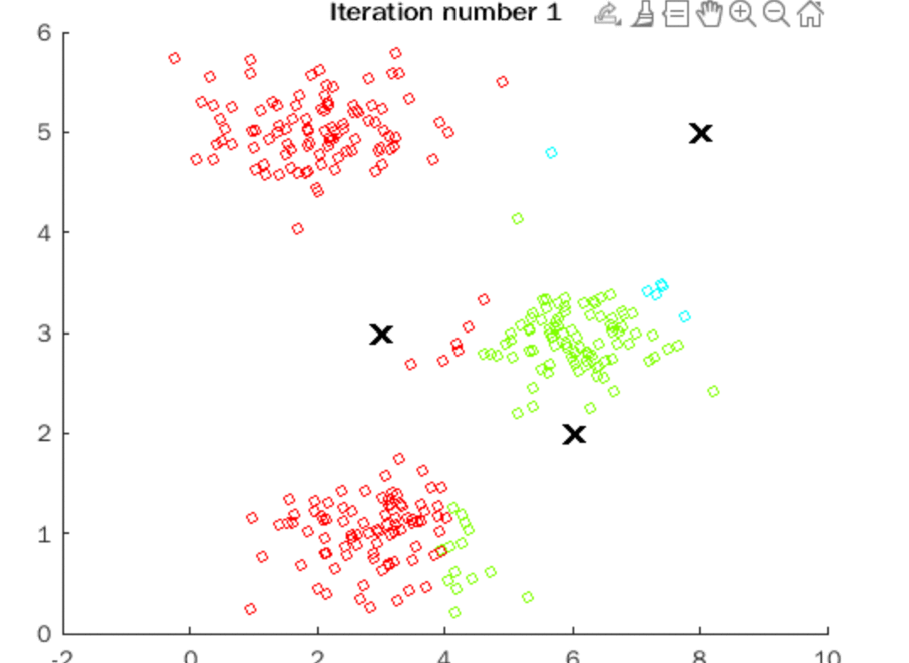

# 机器学习的“变”和“不变”

|  学号   |  姓名  |
| :-----: | :----: |
| 1953902 | 高杨帆 |

[TOC]

## 1. 前言

作为一个机器学习新手，选择这个题目是因为我最近看到一篇文章，Tesla公司的AI总监用pytorch复现了1989年Yann LeCun的那篇具有里程碑意义的用神经网络识别手写邮政编码的论文。也发现33年来在神经网络在宏观意义上没有太大的变化。但是显而易见，机器学习（最近多是深度学习）在生活中的应用趋向多元化，跟其他学科的交叉也逐渐深入，数据集的规模也越来越大，神经网络也越来越多样，机器学习发展几十年来，在应用层次的变化可谓日新月异。故我借本次调研和讨论的机会，以一个机器学习新手的视角，简要阐述一下我眼中的机器学习的“变”和“不变“。

## 2. 什么”不变“

我认为，目前机器学习的热度主要体现在它和各个学科的交叉融合上。剥去不同学科的外衣，机器学习的内核是相似的，无论与哪些学科交叉融合，它的基本任务和基本方法是相似的，这也说明从宏观方面来讲，不仅是上文提到的神经网络，机器学习也没有太大的变化。下面，我具体阐述对这些我眼中的“不变量”的调研和思考。

**基本任务**

不论是什么方面的应用，机器学习的任务大体可以归为四类问题：

1. 分类——**是什么**，主要通过逻辑回归，softmax回归等方法确定不同数据的类别之间的决策边界，类似这样：

2. 预测——**是多少**，主要通过线性回归等方法拟合曲线，并对新数据做出预测，类似这样：

3. 聚类——**怎么分**，主要通过K-means等方法将未标记的数据进行分类，类似这样：

4. 强化学习——**怎么做**，Agent根据一连串的状态决定目前的动作，类似这样（训练两足机器人走路）：

而我们所说的深度学习，实际上是为了提高机器学习模型处理复杂问题（如对图像，语音，自然语言等的处理）的能力和准确率，在神经网络模型层面上的改变和优化，其任务仍然是对数据集进行分类，预测或者聚类。迁移学习是对学习方法的改进，以提高学习的效率；结构化学习则是突破了传统机器学习输入输出均为向量的限制，泛化了机器学习的输入类型，基本任务与传统机器学习仍然没有太大的区别。

**基本数学方法**

机器学习采用的最基本的数学方法是**概率统计和优化**。这两个方法在大部分机器学习算法都会出现，所以我认为这是目前机器学习算法的基础，短时间内应该不会有太大的变化。

就我目前接触到的传统机器学习问题来说，训练一个模型的步骤通常如下：

1. 确定hypothesis函数$h_\theta(x)$
2. 由$h_\theta(x)$确定代价函数$J(\theta)$ 我遇到的基本上都是均方误差（线性回归，K-means聚类）和交叉熵（逻辑回归，softmax回归，单隐藏层神经网络，SVM等），$J(\theta)$一般由**概率统计**的知识得到
3. 利用某种**优化算法**使得$J(\theta)$取得最小值（我目前遇到的大多是梯度下降算法）
4. 此时的$\theta$即是该问题的全局（或局部）最优解

以逻辑回归为例，具体步骤如下：

1. 确定$h_\theta(x) = \dfrac{1}{1+e^{-\theta^Tx}}$ 即是我们所说的sigmoid函数

2. 确定$J(\theta)=-\dfrac{1}{m} (\sum_{i=1}^{m}y^{(i)}\log h_\theta(x^{(i)})+(1-y^{(i)})\log (1-h_{\theta}(x^{(i)})))$ ,这里是交叉熵函数
3. 采用梯度下降算法进行优化直至收敛：

4. 得到$\theta$，这里是全局最优解，可以对新数据进行预测

## 3. 什么“变” 了

**训练条件更好**

回到特斯拉AI总监复现Yann LeCun手写数字识别的例子，虽然在宏观上“数据集-神经网络-训练”的模式没有改变，但是33年来，其细节有着非常大的变化，总结如下：

|      训练条件      |       1989年        |            2022年             |
| :----------------: | :-----------------: | :---------------------------: |
| 数据（训练）集大小 | 7291张16*16灰度图像 | 几亿张图片，输入规模增长1亿倍 |
|    神经网络规模    |   大约9760个参数    |    几十亿，甚至数万亿参数     |
|      训练速度      |         3天         |       90秒（无GPU加速）       |

可以看到，经过33年的发展，在机器学习模型训练的过程中，不论是训练集大小，还是神经网络规模，或者是训练速度，都有着跨越数量级的飞跃和提升。最新的神经网络规模可以达到在transformer模型下1000层的惊人深度：

**机器学习的应用范围更广泛**

正是由于机器学习模型的训练条件更好，其成本较起步阶段大大降低，机器学习的应用，尤其是它与各个学科之间的交叉融合，更加地广泛和深入，下面我简单介绍涉猎过或者感兴趣的机器学习的应用：

1. 机器学习+三维人体重建

smplify-x是MPII(Max Planck Institute of Information) 实验室在2019年的研究成果,其大致原理是先通过OpenPose(CMU研究成果)找到二维人体照片上的关键点,再通过神经网络学习一个模型进行三维人体的重建，其效果如下：

2. 机器学习+语言学

自然语言处理（NLP）是目前机器学习和语言学交叉融合最成熟的方向之一，其主要原理是将文本转化为“词向量”，再通过某些神经网络结构（最近热门的是transformer）训练出模型，完成情感分析，摘要提取，机器翻译，文本补充等任务，Hugging Face Transformer目前是NLP领域中做的比较全面的一个团队：

在对话系统方面，我了解到的一个比较热门的项目是rasa的聊天机器人框架，目前准备用它开发一个聊天机器人，当作NLP的练手项目：

3. 机器学习+音乐

这个是比较有意思的一个领域，我目前了解到的是OpenAI在2019年的研究成果MuseNet，是利用深度学习训练出一个可以续写出不同古典作曲家风格（如巴赫，贝多芬，莫扎特等）或不同流派（如乡村，游戏配乐等）的音乐。下面是一个示例，用巴赫的曲风续写莫扎特的《土耳其进行曲》，汇报的时候会给大家听：

机器学习与各个领域的交叉应用，既是它目前热门的原因，更是机器学习有趣和魅力所在。

## 4. 总结

总之，机器学习发展的过程中，其内核任务和数学方法没有太大的变化，但是随着硬件技术的不断发展，计算机的算力有了质的飞跃，从而机器学习的成本减少，外部条件优化，因此在更多的方面得到了应用，与更多的学科交叉融合，也更加深入地融入到我们的生活中。

以上就是我对机器学习发展过程中的“变”和“不变”的调研与思考，这只是一个新手的粗浅想法，如有不正确或者不完善的地方，还请老师和助教指出。

**参考资料**

1. 机器学习发展历史回顾：https://zhuanlan.zhihu.com/p/43833351
2. 特斯拉AI总监：我复现了LeCun 33年前的神经网络，发现和现在区别不大： https://mp.weixin.qq.com/s/VQLISCmaHDX-TFryadxURg
3. 解决训练难题，1000层的Transformer来了，训练代码很快公开：https://mp.weixin.qq.com/s/ejXE4-oBkqqtYITKZHpudQ
4. Coursera吴恩达机器学习课程slides & exercises: https://www.coursera.org/learn/machine-learning
5. smplify-x: https://ps.is.mpg.de/uploads_file/attachment/attachment/497/SMPL-X.pdf
6. Hugging Face Transformer: https://huggingface.co/docs/transformers/quicktour
7. Rasa: https://rasa.com/
3. OpenAI MuseNet: https://openai.com/blog/musenet/
